# Chapter 1: Computer Networks and the Internet

## 1.1 What is the Internet?

### 1.1.1 A nuts-and-bolts description

The Internet is a computer networks that interconnects hundreds of millions of computing devices through the world. Today not only computers and workstation are being connected to the network, therefore the term *computer network* may sound a bit dated.

All the devices connected to the Internet are called **hosts** or **end systems**. End systems are connected together by a network of **communication links** and **packets switches**.

Different links can transmit data at different rates, with the **transmission rate** of a link measured in bits/second.

When one end system has data to send to another end system, the sending end system *segments* the data and adds *header bytes* to each segment. The resulting packages of information, called **packets**, are then sent through the network to the destination and system where they a reassembled into the original data.

A packet switch takes a packet arriving on one of its incoming communication links and forwards that packet on one of its outgoing communication links. The two most prominent types of packets switches are **routers** and **link switches**. The sequence of communication links and packet switches traversed by a packet from the sending end system to the receiving end system is known as **route** or **path**.

End systems access the Internet through **Internet Service Providers (ISPs)**, including residential ISPs (cable or phone company), corporate, university ISPs ...
Each ISP in itself is a network of packet switches and communication links.
*Lower tier* (which interconnect end-systems) ISPs are interconnected through national and international *upper tier* ISP. An upper-tier ISP consists of high speed routers interconnected with high-speed fiber-optic links. Each ISP network is managed independently.

End systems, packet switches and other pieces of the Internet run **protocols** that control the sending and receiving of information within the Internet.

### 1.1.2 A Services Description
The Internet can be described as *an infrastructure that provides services to applications*. These applications (Web, social networks, VoIP...) are said to be **distributed** since they involve multiple end systems that exchange data with each other.
**Internet applications run on end systems, not in the packet switches or routers**, packet switches facilitate the exchange of data, but they are not concerned with the application that is the source or sink of data.

End systems attached to the Internet provide and **Application Programming Interface (API)** that specifies how a program running on one end system asks the Internet infrastructure to deliver data to a specific destination program running on another end system.

### 1.1.3 What Is a Protocol?
All the activity in the Internet that involves two or more communicating remote entities is governed by a protocol.

**A protocol defines the format and the order of messages exchanged between two or more communicating entities, as weel as the actions taken on the trasmission and/or receipt of a message or other event**

## 1.2 The Network Edge
Computers and other devices connected to the Internet are often referred to as *end systems* as they sit at the edge of the Internet. They are also called *hosts* as they host, run, applications programs such as a Web Browser or an email client.

Hosts are sometimes further divided into two categories: *clients* and *servers*. The former being desktop, mobile pcs, smartphones, the latter being powerful machines that store and distribute Web pages, streams...
Nowadays most of the servers reside in large *data centers*

### 1.2.1 Access Networks
They are the networks that physically connect end systems to the first router on a path from the end system to any other distant end system.
Examples: mobile network, national or global ISP, local or regional ISP, home networks enterprise networks.

#### Home Access: DSL, Cable, FITH, Dial-Up and Satellite
Today, the two most prevalent types of broadband residential access are **digital subscriber line (DSL)** and **cable**.

A residence typically obtains DSL access from the telephone company (telco) that provides its wired local phone access. The customer's telco is therefore its ISP.
DSL modem use the existing telephone lines to exchange data with DSLAMs (digital subscriber line access multiplexer) located in the telco local central office. The DSL modem takes digital data and translates it to high-frequency tones for transmission over telephone wires, these analog signals from many houses are translated back into digital format at the DSLAM. The use of different frequencies allows the phone line to carry a high-speed downstream channel, a medium-speed upstream channel and an ordinary two-way telephone channel.
Hundreds or even thousands of households connect to a single DSLAM.

DSL: 24 Mbps downstream and 2.5 Mbps upstream (MAX VALUES). Because of the difference between these two values, the access is said to be **asymmetric**.

**Cable Internet** access makes use of the cable television company's existing cable television infrastructure. Cable modems connect to CMTS (Cablem Modem Termination System) which does the same job the DSLAM does for phone lines. The access is typically asymmetric.
CABLE: 42.8 Mbps downstream and 30.7 Mbps upstream (MAX VALUES).
Cable Internet access is a shared broadcast medium: each packet travels downstream on every link to every home and viceversa. For this, if several users are simultaneously using the downstream channel, the actual rate will be significantly lower.

Another up-and-coming technology that promises very high speeds is **fiber to the home (FTTH)**. The concept is simple: provide an optical fiber path from the Central Office (CO)

#### Access in the Enterprise and the Home: Ethernet and WiFi
On corporate and university campuses, and increasingly in home settings, a **Local Area Network (LAN)** is used to connect an end system to the edge router.
Ethernet is by far the most prevalent access technology is corporate, university and home networks. Ethernet uses twisted-pair copper wire to connect to an Ethernet switch which is connected into the larger Internet.
The Internet is increasingly accessed wirelessly: wireless users transmit/receive packets to/from an access point connected into the enterprise's network which in turn is connected to the wired Internet.

#### Wide-Area Wireless Access: 3G and LTE
Smartphones and Tablets employ the same wireless infrastructure used for cellular telephony to send/receive packets through a base station operated by the cellular network provider. Third generation (3G) wireless and fourth generation (4G) of wide-area network are being deployed. LTE ("Long-Term Evolution") has its root in 3G and can potentially achieve rates in excess of 10 Mbps.

### 1.2.2 Physical Media
The book talks about it in detail but we haven't talked about it in class

A bit, when traveling from source to destination, passes through a series of transmitter-receiver pairs, for each pair, the bit is sent by propagating electromagnetic waves or optical pulses across a **physical medium**. This can take many shapes and forms and doesn't have to be of the same type for each transmitter-receiver pair along the path.
Physical media fall into two categories:

 - **guided media**: the waves are guided along a solid medium (fiber-optic cable, twisted-pair copper wire, coaxial cable)
 - **unguided media**: the waves propagate in the atmosphere and in outer space (wireless LAN, digital satellite channel)

## 1.3 The Network Core

### 1.3.1 Packet Switching
In a network application, end systems exchange **messages** with each other. To send a message from a source end system to a destination end system, the source breaks long messages into smaller chunks of data known as **packets**.
Between source and destination, each packet travels through communication links and **packet switches** (for which there are two predominant types, **routers** and **link-layer switches**).
Packets are transmitted over each communication link at a rate equal to the *full* transmission rate of the link. So, if a source end system or a packet switch is send a packet of L bits over a link with transmission rate R bits/sec, then the time to transmit the packet is L/R seconds.

#### Store-and-forward Transmission
Most packet switches use **store-and-forward transmission** at the inputs to the links. Store-and-forward transmission means that the packet switch must receive the entire packet before it can begin to transmit the first bit of the packet onto the outbound link. The link must **buffer** ("store") the packet's bits and only after the router has received all of the packet's bits can it begin to transmit ("forward") the packet onto the outbound link.

#### Queuing Delays and Packet Loss
Each packet switch has multiple links attached to it. For each attached link, the packet switch has an **output buffer** (or **output queue**) which stores packets that the router is about to send into that link.
If an arriving packet needs to be transmitted onto a link but finds the link busy with the transmission of another packet, the arriving packet must wait in the output buffer. Thus, packets suffer output buffer **queuing delays** which are variable and depend on the level of congestion in the network. Since the amount of buffer space is finite, an arriving packet may find the buffer completely full. In this case, **packet loss** will occur, either the arriving packet or one of the already queued packets will be dropped.

#### Forwarding tables and routing protocols
In the Internet, every end system has an address called an IP address. When a source end system wants to send a packet to a destination end system, the source includes the destination's IP address in the packet's header.
Each router has a **forwarding table** that maps destination addresses (or portions of the destination addresses) to that router's outbound links. When a packet arrives at the router, the router examines the address and searches its forwarding table, using this destination address, to find the appropriate outbound link.
A number of special **routing protocols** are used to automatically set the forwarding tables.

### 1.3.2 Circuit Switching
In circuit-switched networks, the resources needed along a path(buffers, link transmission rate) to provide for communication between the end systems are **reserved** for the duration of the communication sessions.
When two hosts want to communicate, the network establishes a **dedicated end-to-end connection** between them.

#### Multiplexing in Circuit-Switched Networks
A circuit in a link is implemented with either **frequency-division multiplexing (FDM)** or **time-division multiplexing (TDM)**.
With FDM, the frequency spectrum of a link is divided up among the connections established across the link. The width of the band is called the **bandwidth**.
For a TDM link, time is divided into frames of fixed duration, and each frame is divided into a fixed number of time slots.

#### Packet Switching Versus Circuit Switching
Packet switching is more flexible, uses resources efficiently and is simpler to implement (even if it requires congestion control).
Circuit switching offers performance guarantees but uses resources inefficiently

### 1.3.3 A Network of Networks
To create the Internet, ISPs must be interconnected, thus creating a *network of networks*.
Much of the evolution of the structure of the Internet is driven by economics and national policy, rather than by performance consideration.

Today's Internet is complex, consisting of a dozen or so tier-1 ISPs and hundreds of thousands of lower-tier ISPs. The ISPs are diverse in their coverage, with some spanning multiple continents and oceans, and others limited to narrow geographic regions. The lower-tier ISPs connect to the higher-tier ISPs and the higher-tier ISPs interconnect with one another. Users and content providers are customers of lower-tier ISPs and lower-tier ISPs are customers of higher-tier ISPs. Recently, major content providers (Google) have also created their own networks and connect directly into lower-tier ISPs where possible.

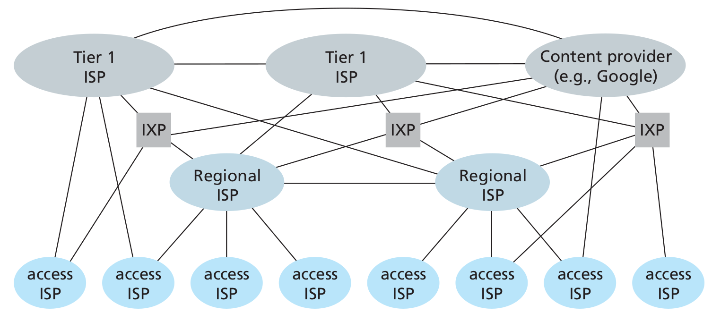

## 1.4 Delay, Loss and Throughput in Packet-Switched Networks

Computer networks necessarily constrain **throughput** (the amount of data per second that can be transferred) between end system, introduce delays between end systems and can actually lose packets.

### 1.4.1 Overview of Delay in Packet-Switched networks
As a packet travels from one node (host or router) to the subsequent host along his path, it suffers from several types of delays at *each* node along the path.

#### Types of Delay


##### Processing Delay
The **processing delay** consists of the time required to examine the packet's header and determine where to direct the packet. It may also include other factors, such as the time needed to check for bit-level errors occurred during transmission.
They typically are of the order of microseconds or less.
After processing the packet is sent to the queue preceding the link to the next router

##### Queuing Delay
At the queue, the packet experiences a **queuing delay** as it waits to be transmitted onto the link. It depends on the number of earlier-arriving packets, therefore if the queue is empty, then the packet's queuing delay will be 0.
Typically of the order of microseconds or milliseconds.

##### Transmission delays
If the length of the packet is *L* bits, and the **transmission rate** of the link is *R* bits/sec, then the **transmission delay** is *L/R*.
This is the amount of time required to push (transmit) all of the packet's bits into the link.
Typically on the order of microseconds to milliseconds.

##### Propagation Delay
The time required to propagate a bit from the beginning of the link to the next router is the **propagation delay**. The bit propagates at the propagation speed of the link, which depends on the physical medium of the link.
The propagation delay is the distance between two routers divided by the propagation speed of the link.

##### Total nodal delay
it is the summation of the previous delays

### 1.4.2 Queuing Delay and Packet Loss
The queuing delay depends can vary from packet to packet, therefore when characterizing queuing delay, one typically uses statistical measures, such as *average queuing delay, variance of queuing delay, and the probability that the queuing delay exceeds some specified value*.

#### Packet Loss
A queue preceding a link has finite capacity. If a packet finds a full queue, then the router will **drop** it, the packet will be lost.
The fraction of lost packets increases as the traffic intensity increases.

### 1.4.3 End-to-End Delay
Let's now consider the **total delay, from source to destination** (not only the nodal delay). Let's suppose there are *N-1* routers between the source host and the destination host, then the nodal delays accumulate and give an **end-to-end delay**:

```
d(end_end) = N * [d(proc) + d(queue) + d(trans) + d(prop)]
```

### 1.4.4 Throughput in Computer Networks
Another critical performance measure in computer networks is *end-to-end throughput*.
The **instantaneous throughput** at any instant of time is the rate (in bits/sec) at which host B is receiving a file.
If the file consists of *F* bits and the transfers takes *T* seconds to transfer the whole file, then the **average throughput** of the file is *F/T bits/sec*.
For a simple two-link network, the throughput is the min of all the throughputs, that is the transmission rate of the **bottleneck link**.
Therefore, the constraining factor for throughput in today's Internet is typically the *access network*.

## 1.5 Protocol Layers and Their Service Models

### 1.5.1 Layered Architecture
A layered architecture allows us to discuss a well-defined, specific part of a large and complex system. This simplification itself is of considerable value by providing *modularity*, making it much easier to change the implementation of the service provided by the layer: as long as the layer provides the same service to the layer above it, and uses the same services from the layer below it, the remainder of the system remains unchanged when a layer's implementation is changed.

#### Protocol Layering
To provide structure to the design of network protocols, the network designers organize protocols in **layers**. **Each protocol belongs to one of the layers**. We are interested in the **services** that a layer offers to the layer above, **service model** of a layer.
When taken together, the protocols of the various layers are called the **protocol stack**. The Internet protocol stack consists of five layers:

 - Application
 - Transport
 - Network
 - Link
 - Physical

##### Application Layer
Where network applications and their applications-layer protocols reside.
The Internet's application layer includes many protocols: HTTP, SMTP, FTP, DNS.
An application-layer protocol is distributed over multiple end systems, with the application in one end system using the protocol to exchange packets of information with the application in another end system. This packet of information at the application layer is called **message**.

##### Transport Layer
It transports application-layer messages between application endpoints.
In the Internet there are two transport protocols: TCP and UDP.
TCP provides a connection-oriented service to its application: the service includes guaranteed delivery of application-layer messages to the destination and flow control unit. TCP also breaks long messages into shorter segments and provides a **congestion-control mechanism**, so that a source throttles its transmission rate when the network is congested.
HTTP and SMTP use TCP

UDP provides a connectionless service to its applications: it's a no-frills service that provides no guarantees, no reliability, no flow control and no congestion control.
A transport-layer packet is called **segment**
Skype uses UDP (speed required)

##### Network Layer
It is responsible for moving network-layer packets known as **datagrams** from one host to another.
The Internet's network layer includes the IP Protocol. There is only one IP Protocol and all the Internet components that have a network layer must run it.
The Internet's network layer also contains routing protocols that determine the routes that datagrams take between sources and destinations.
The Internet has many routing protocols.
Often it is simply referred to as the IP protocols, forgetting that it includes routing too.

##### Link Layer
To move a packet from one node to the next, the network layer relies on the services of the link layer.
The services provided by the link layer depend on the specific link-layer protocol that is employed over the link.
Examples are Ethernet, WiFi.
We will refer to the link-layer packets as **frames**

##### Physical Layer
The job of the physical layer is to move the individual bits within the frame from one node to the next.
The protocols are link dependent and further depend of the actual transmission medium of the link.

### 1.5.2 Encapsulation
Routers and link-layer switches are both packet switches but routers and link-layer switches do not implement all of the layers in the protocol stack: link-layer switches implement Physical and Link while router add the Network Layer too.

From the Application Layer, the message passes to the transport layer, which appends additional information to it (the **Header**) that will be used by the receiver-side transport layer. The transport layer then adds its own header and passes the datagram to the link layer which adds it own link-layer header information.
Thus, we see that at each layer, a packet has two types of fields: **header fields** and a **payload field**, the payload typically being the packet from the layer above.

The process of encapsulation can be more complex: for example a large message may be divided into multiple transport-layer segments, which will be divided into multiple datagrams....

## 1.6 Networks Under Attack

### Malware
Along with all the good files we exchange on the Internet, come malicious software, collectively known as **malware** that can also enter and infect our devices.
Once a device infected, the malware can do all kinds of evil things: deleting files, install spyware...
A compromised host may also be enrolled in a network of thousands of similarly compromised devices, known as **botnet** which can be used for spam or distributed denial-of-service.
Much of the malware is **self-replicating**: it seeks entry into other hosts from the infected machines. Malware can spread in the from of a virus or a worm.

 - **Viruses** are malware that requires some form of user interaction to infect the user's device.
 - **Worms** are malware that can enter a device without any explicit user interaction.

### DoS
Denial-of-Service attacks render a network, host, or other piece of infrastructure unusable by legittimate users. Most of them fall into one of the three categories:

 - *Vulnerability Attack*: a few well-crafted messages are sent to a vulnerable application or operating system running on the targeted host. The service might stop or the host might crash.
 - *Bandwidth flooding*: a deluge of packets is sent to the targeted host, so many packets that the target's access link becomes clogged preventing legitimate packets from reaching the server
 - *Connection flooding*: a large number of half-open or fully open TCP connections are established at the targeted host, which can become so bogged down that it stops accepting legitimate connections.

In a **distributed DoS** (**DDoS**) attack the attacker controls multiple sources and has each source blast traffic at the target.

### Sniffing
A passive receiver can record a copy of every packet that passes through the network. It is then called a **packet sniffer**.
Because packet sniffers are *passive* (they do not inject packets into the channel), they are difficult to detect. Some of the best defenses against packet sniffing involve cryptography.

### Spoofing
The ability to inject packets into the Internet with a false source address is known as **IP Spoofing** and is but one of many ways in which one user can masquerade as another user.
To solve this problem we will need *end-point authentication*.

### The history of the Internet shaped is structure
The Internet was originally designed to be based on the model of a *group of mutually trusting users attached to a transparent network*, a model in which there is no need for security. Many aspects of the original Internet architecture deeply reflect this notion of mutual trust, such as the ability for one to send a packet to any other user is the default rather than a requested/granted capability.
However today's Internet certainly does not involve "mutually trusted users": communication among mutually trusted users is the exception rather the rule.

## History of Computer Networking and the Internet

# Chapter 2: Application Layer
Network applications are the *raison d'être* of a computer network. They include  text email, remote access to computers, file transfers, the WorldWideWeb (mid 90s), web searching, e-commerce, Twitter/Facebook, Amazon, Netflix, Youtube, WoW...

## 2.1 Principles of Network Applications
At the core of network application development is writing programs that run on different **end systems** and communicate with each over the network. The programs running on end systems might be different (server-client architecture) or identical (Peer-to-Peer architecture).
Importantly we write programs that run on end systems/hosts, not on network-core devices (routers/link-layer switches).

### 2.1.1 Network Application Architectures
From the application developer's perspective, the network architecture is fixed and provides a specific set of services to applications.
The **application architecture**, on the other hand, is chosen by him. In choosing the application architecture, a developer will likely draw one of the two predominant architectural paradigms used in modern network applications:

 - **Client-server architecture**: there is an always on host, called the *server* which serves requests from many other hosts, called *clients*: [Web Browser and Web Server]. Clients do not communicate directly with each other. The server has a fixed, well-known address, called an IP address that clients use to connect to him. Often, a single server host is incapable of keeping up with all the requests from clients, for this reason, a **data center**, housing a large number of hosts, is often used to create a powerful virtual server (via *proxyin*).
 - **P2P architecture**: there is minimal or no reliance on dedicated servers in data centers, the application exploits direct communication between pairs of intermittently connected bots, called *peers*. They are end systems owned and controlled by users. [Bittorrent, Skype]. P2P applications provide **self-scalability** (the network load is distributed) They are also **cost-effective** since they don't require significant infrastructure and server bandwidth. P2P face challenges:
	1. ISP Friendly (asymmetric nature of residential ISPs)
	2. Security
	3. Incentives (convincing users to participate)

Some applications have hybrid architectures, such as for many instant messaging applications: a server keeps track of the IP addresses of users, but user-to-user messages are sent directly between users.

### 2.1.2 Processes Communicating
In the jargon of operating systems, it's not programs but **processes** that communicate. A process can be thought of as a program that is running within an end system.
Processes on two different end systems communicate with each other by exchanging **messages** across the computer network: a sending process creates and sends messages into the network, a receiving process receives these messages and possibly responds by sending messages back.

#### Client and Server Processes
A network application consists of pairs of processes that send messages to each other over a network. For each pair of communicating processes we label:

 - the process that initiates the communication as the **client** [web browser]
 - the process that waits to be contacted to begin the session as the **server** [web server]

This labels stand even for P2P applications in the *context of a communication session*.

#### The Interface Between the Process and the Computer Network
A process sends messages into, and receives messages from, the network through a software interface called a **socket**.
**A socket is the interface between the application layer and the transport layer within a host**, it is also referred to as the **Application Programming Interface** (**API**) between the application and the network.
The application developer has control of everything on the application-layer of the socket but has little control of the transport-layer side of the socket. The only control that he has over the transport-layer is:

 1. The choice of the transport protocol
 2. Perhaps the ability to fix a few transport-layer parameters such as maximum buffer and maximum segment sizes

#### Addressing Processes
In order for a process running on one host to send packets to a process running on another host, the receiving process needs to have an address. To identify the receiving processes, two pieces of information need to be specified:

 1. The address of the host. In the Internet, the host is identified by its **IP Address**, a 32-bit (or 64) quantity that identifies the host uniquely.
 2. An identifier that specifies the receiving process in the destination host: the destination **port number**. Popular applications have been assigned specific port numbers (web server -> 80)

### 2.1.3 Transport Services Available to Applications
What are the services that a transport-layer protocol can offer to applications invoking it?

#### Reliable Data Transfer
For many applications, such as email, file transfer, web document transfers and financial applications, packet's drops and data loss can have devastating consequences. If a protocol provides guarantees that the data sent is delivered completely and correctly, it is said to provide **reliable data transfer**. The sending process can just pass its data into the socket and know with complete confidence that the data will arrive without errors at the receiving process.

#### Throughput
A transport-layer protocol could provide guaranteed available throughput at some specific rate. Applications that have throughput requirements are said to be **bandwidth-sensitive applications**.

#### Timing
A transport-layer protocol can also provide timing guarantees. Example: guarantees that every bit the sender pumps into the socket arrives at the receiver's socket no more than 100 msec later, interesting for real-time applications such as telephony, virtual environments...

#### Security
A transport-layer protocol can provide an application with one or more security services. It could encrypt all data transmitted by sending process and in the receiving host decrypt it.

### 2.1.4 Transport Services Provided by the Internet
The Internet makes two transport protocols available to applications: TCP and UDP.

#### TCP Services
TCP includes a connection-oriented service and a reliable data transfer service:

 - **Connection-oriented service**: client and server exchange transport-layer control information *before* the application-level messages begin to flow. This so-called *handshaking* procedure alerts the client and server, allowing them to prepare for an onslaught of packets. Then a **TCP connection** is said to exist between the sockets of the two processes. When the application finishes sending messages, it must tear down the connection

##### SECURING TCP
Nether TCP nor UDP provide encryption. Therefore the Internet community has developed an enhancement for TCP called **Secure Sockets Layer (SSL)**, which not only does everything that traditional TCP does but also provides critical process-to-process security services including *encryption*, *data integrity* and *end-point authentication*. It is not a third protocol, but an enhancement of TCP, **the enhancement being implemented in the application layer** in both the client and the server side of the application (highly optimized libraries exist). SSL has its own socket API, similar to the traditional one. Sending processes passes cleartext data to the SSL socket which encrypts it.

 - **Reliable data transfer service** The communicating processes can rely on TCP to deliver all data sent without error and in the proper order.

TCP also includes a **congestion-control mechanism**, a service for the general welfare of the Internet rather than for the direct benefit of the communicating processes. It throttles a sending process when the network is congested between sender and receiver.

#### UDP Services
UDP is a no-frills, lightweight transport protocol, providing minimal services. It is connectionless, there's no handshaking. The data transfer is unreliable: there are no guarantees that the message sent will ever reach the receiving process. Furthermore messages may arrive out of order. UDP does not provide a congestion-control mechanism neither.

#### Services Not Provided by Internet Transport Protocols
These two protocols do not provide timing or throughput guarantees, services not provided by today's Internet transport protocols. We therefore design applications to cope, to the greatest extent possible, with this lack of guarantees.

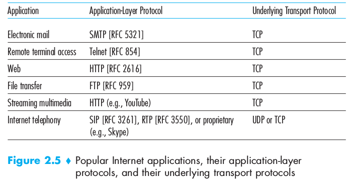

### 2.1.5 Application-Layer Protocols
An **application-layer protocol** defines how an application's processes, running on different end systems, pass messages to each other. It defines:

 - The type of the messages exchanged (request/response)
 - The syntax of the various message types
 - The semantics of the fields (meaning of the information in fields)
 - The rules for determining whem and how a process sends messages and responds to messages

## 2.2 The Web and HTTP
In the early 1990s, a major new application arrived on the scene: the World Wide Web (Berners-Lee 1994), the first application that caught the general public's eye.
The Web operates *on demand*: users receives what they want, when they want it.
It is enormously easy for an individual to make information available over the web, hyperlinks and search engines help us navigate through the ocean of web sites...

### 2.2.1 Overview of HTTP
The **HyperText Transfer Protocol (HTTP)**, the Web's application-layer protocol is a the heart of the Web. It is implemented in two programs: a client program and a server program.
The two programs talk to each other by exchanging HTTP messages.
A **Web page** (or document) consists of objects. An **object** is simply a file (HTML file, jpeg image...) that is *addressable by a single URL*.
Most Web pages consist of a **base HTML file** and several referenced objects. The HTML file references the other objects in the page with the objects' URLs.
Each URL has two components: the hostname of the server that houses the object and the object's path name.
**Web Browsers** implement the client side of HTTP.
**HTTP** uses TCP as its underlying transport protocol.
The server sends requested files to clients without storing any state information about the client: it is a **stateless protocol**

### 2.2.2 Non-Persistent and Persistent Connections
In many Internet applications, the client and server communicate for an extended period of time, depending on the application and on how the application is being used, the series of requests may be back-to-back, periodically at regular intervals or intermittently. When this is happening over TCP, the developer must take an important decision: should each request/response pair be sent over a *separate* TCP connection or should all of the requests and their corresponding responses be sent over the *same* TCP connection?
In the former approach, the application is said to use **non-persistent connections** and in the latter it is said to use **persistent connections**
By default HTTP uses non-persistent connections but can be configured to be use persistent connections.
To estimate the amount of time that elapses when a client requests the base HTML file until the entire file is received by the client we define the **round-trip time** (**RTT**) which is the time it takes for a small packet to travel from client to server and then back to the client.

#### HTTP with Non-Persistent Connections
For the page and each object it contains, a TCP connection must be opened (handshake request, handshake answer), we therefore observe an addition RTT, and for each object we will have a request followed by the reply
This model can be expensive on the server side: a new connection needs to be established for each requested object, for each connection a TCP buffer must be allocated along some memory to store TCP variables.

#### HTTP with Persistent Connections
The server leaves the TCP connection open after sending a response, subsequent requests and responses between the same client and server will be sent over the same connection. In particular an entire web page (text + objects) ca be sent over a single persistent TCP connection, multiple web pages residing on the same server can be sent from the server to the same client over a single persistent TCP connection.
**These requests can be make back-to-back** without waiting for replies to pending requests (**pipelining**).
When the server receives back-to-back requests, it sends the objects back-to-back.
If connection isn't used for a pre-decided amount of time, it will be closed.


### 2.2.3 HTTP Message Format
Two types of HTTP messages:

#### HTTP Request Message

```
GET /somedir/page.html HTTP/1.1
Host: www.someschool.edu
Connection: close
User-agent: Mozilla/5.0
Accept-language: fr
```

 - Ordinary ASCII text
 - First line: **request line**
 - Other lines: **header lines**
 - the first lines has 3 fields: method field, URL field, HTTP version field:
	- method field possible values: `GET, POST, HEAD, PUT, DELETE`

The majority of HTTP requests use the GET method, used to request an object.

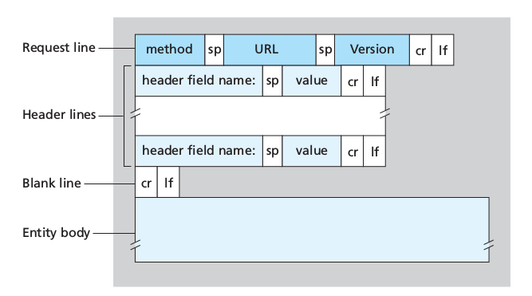

 The entity body (empty with `GET`) is used by the `POST` method, for example for filling out forms. The user is still requesting a Web page but the specific contents of the page depend on what the user entered into the form fields. When `POST` is used, the entity body contains what the user entered into the form fields.
Requests can also be made with `GET` including the inputted data in the requested URL.
The `HEAD` method is similar to `GET`, when a server receives it, it responds with an HTTP message but it leaves out the requested object. It is often used for debugging.
`PUT` is often used in conjunction with web publishing tools, to allow users to upload an object to a specific path on the web servers.
Finally, `DELETE` allows a user or application to delete an object on a web server.

#### HTTP Response Message
A typical HTTP response message:

```
HTTP/1.1 200 OK
Connection: close
Date: ...
Server: ...
Last-Modified: ...
Content-Length: ...
Content-Type: text/html

(data data data data data ...)
```
 - Status line: protocol version, status code, corresponding status message
 - six header lines:
 	- the connection will be closed after sending the message
	- date and time when the response was created (when the server retrieves the object from the file system, insert object in the message, sends the response message)
	- Type of the server / software
	- Last modified: useful for object caching
	- Content-Length: number of bytes in the object
	- Content-Type
 - entity body: contains the requested object itself (data)

Some common status codes:
 - `200 OK`: request succeeded, information returned
 - `301 Moved Permanently`: the object has moved, the new location is specified in the header of the response
 - `400 Bad Request`: generic error code, request not understood
 - `404 Not Found`: The requested document doesn't exist on the server
 - `505 HTTP Version Not Supported`: The requested HTTP protocol version is not supported by the server

### 2.2.4 User-Server Interaction: Cookies
An HTTP server is *stateless* in order to simplify server design and improves performances. A website can identify users using **cookies**.
Cookie technology has 4 components:

 1. Cookie header in HTTP response message
 2. Cookie header in HTTP request message
 3. Cookie file on the user's end-system managed by the browser
 4. Back-end database at the Website

User connects to website using cookies:

 - Server creates a unique identification number and creates an entry in its back-end database indexed by the identification number
 -server responds to user's browser including in the header: `Set-cookie: identification number`
 - The browser will append to the cookie file the hostname of the server and the identification number header
 - Each time the browser will request a page, it will consult the cookie file, extract the identification number for the site and put a cookie header line including the identification number

The server can track the user's activity: it knows exactly what pages, in which order and at what times that identification number has visited. This is also why cookies are controversial: a website can learn a lot about a user and sell this information to a third party.

Therefore **cookies can be used to create a user session layer on top of stateless HTTP**.

### 2.2.5 Web Caching
A **Web cache**, also called **proxy server** is a network entity that satisfies HTTP requests on behalf of an origin Web server. It has its own disk storage and keeps copies of recently requested objects in this storage.

 1. The browser establishes a TCP connection to the web cache, sending an HTTP request for the object to the Web cache.
 2. The web cache checks to see if it has a copy of the object stored locally. If yes, it will return it within an HTTP response message to the browser.
 3. If not, the Web cache opens a TCP connection to the origin server, which responds with the requested object.
 4. The Web caches receives the object, stores a copy in its storage and sends a copy, within an HTTP response message, to the browser over the existing TCP connection.

Therefore a **cache is both a server and a client at the same time**.
Usually caches are purchased and installed by ISPs.
They can substantially reduce the response time for a client request and substantially reduce traffic on an institution's access link to the Internet.

Through the use of **Content Distribution Networks (CDNs)** web caches are increasingly playing an important role in the Internet. A CDN installs many geographically distributed caches throughout the Internet, localizing much of the traffic.

### 2.2.6 The Conditional `GET`
Caches introduce a new problem: what if the copy of an object residing in the cache is stale?
The **conditional GET** is used to verify that an object is up to date.
An HTTP request message is a conditional get if

 1. the request message uses the `GET` method
 2. the request message includes an `If-modified-since:` header line.

A conditional get message is sent from the cache to server which responds only if the object has been modified.

## 2.5 DNS - The Internet's Directory Service
One identifier for a host is its **hostname** [`cnn.com`, `www.yahoo.com`]. Hostnames are mnemonic and therefore used by humans. Hosts are also identified by **IP addresses**.

### 2.5.1 Services provided by DNS
Routers and use IP addresses. The Internet's **domain name system (DNS)** translates hostnames to IP addresses. The DNS is:

 1. A distributed database implemented in a hierarchy of **DNS Servers**
 2. An application-layer protocol that allows hosts to query the distributed database.

DNS servers are often UNIX machines running the **B**erkeley **I**nternet **N**ame **D**omaine (BIND) software.

**DNS runs over UDP and uses port 53**
It is often employed by other application-layer protocols (HTTP, FTP...) to translate user-supplied hostnames to IP addresses.

How it works:

 - The user machine runs the client side of the DNS application
 - The browser extracts `www. xxxxx . xxx` from the URL and passes the hostname to the client side of the DNS application
 - The DNS sends a query containing the hostname to a DNS server
 - The DNS client eventually receives a reply including the IP address for the hostname
 - The browser can initiate a TCP connection.

**DNS adds an additional delay**

DNS provides other services in addition to translating hostnames to IP addresses:

 - **host aliasing**: a host with a complicated hostname can have more alias names. The original one is said to be a **canonical hostname**.
 - **mail server aliasing**: to make email servers' hostnames more mnemonic. This also allows for an e-mail server and an Web server to have the same hostname.
 - **load distribution**: replicated servers can have the same hostname. In this case, a set of IP addresses is associated with one canonical hostname. When a client make a DNS query for a name mapped to a set of addresses, the server responds with the entire set, but rotates the ordering within each reply.

### 2.5.2 Overview of How DNS Works
From the perspective of the invoking application in the user's host, DNS is a black box providing a simple, straightforward translation service.
Having one single global DNS server would be simple, but it's not realistic because it would a **single point of failure**, it would have an impossible **traffic volume**, it would be **geographically too distant** from some querying clients, its **maintenance** would be impossible.


#### A Distributed, Hierarchical Database
The DNS uses a large number of servers, organized in a hierarchical fashion and distributed around the world.


The three classes of DNS servers:

 - **Root DNS servers**: In the Internet there are 13 root DNS servers, most hosted in North America, each of these is in reality a network of replicated servers, for both security and reliability purposes (total: 247)
 - **Top-level domain (TLD) servers**: responsible for top-level domains such as com org net edu and govand all of the country top-level domains uk fr jp
 - **Authoritative DNS servers**: every organization with publicly accessible hosts must provide publicly accessible DNS records that map the names of those hosts to IP addresses. An organization can choose to implement its own authoritative DNS server or to pay to have the records stored in an authoritative DNS of some service provider.

Finally there are **local DNS servers** which is central to the DNS architecture. They are hosted by ISPs. When a hosts connects to one of these, the local DNS server provides the host with the IP addresses of one or more of its local DNS servers. Requests can ho up to the root DNS servers and back down.

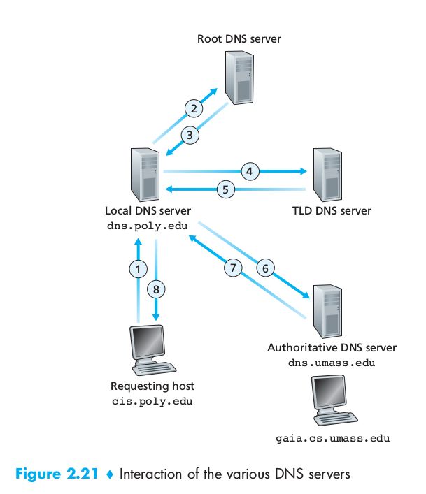

We can have both **recursive** and **iterative queries**.
In **recursive queries** the user sends the request its nearest DNS which will ask to a higher-tier server, which will ask to lower order... the chain goes on until it reaches a DNS that can reply, the reply will follow the inverse path that the request had.
In **iterative queries** the same machine sends requests and receives replies.
Any DNS can be iterative or recursive or both.

#### DNS Caching
DNS extensively exploits DNS caching in order to improve the delay performance and to reduce the number of DNS messages ricocheting around the Internet.
In a query chain, when a DNS receives a DNS reply it can cache the mapping in its local memory.

### 2.5.3 DNS Records and Messages
The DNS servers that implement the DNS distributed database store **resource records (RRs)** including RRs that provide hostname-to-IP address mappings.
Each DNS reply messages carries one or more resource records.

A resource record is a four-tuple that contains the fields: `(Name, Value, Type, TTL)`
`TTL` is the time to live of the resource record (when a resource should be removed from a cache). The meaning of `Name` and `Value` depend on `Type`:

| Type | Name | Value |
|--- | --- | --- |
| A     	| a hostname         	| IP address                                                                                                                                                          	|
| NS    	| a domain (foo.com) 	| hostname of an  authoritative DNS server which knows how to obtain the IP addresses for hosts in the domain. Used to route queries further along in the query chain 	|
| CNAME 	| a alias name       	| canonical hostname for the name in Name                                                                                                                             	|
| MX    	| alias hostname     	| canonical hostname of a mail server that has an alias hostname Name                                                                                                 	|
#### DNS Messages
The only types of DNS messages are DNS queries and reply messages. They have the same format:

 - first 12 bytes in the *header section*: 16-bit number identifying the query, which will be copied into the reply query so that the client can match received replies with sent queries. 1 bit query/reply flag (0 query, 1 reply). 1 bit flag authoritative flag set in reply messages when DNS server is an authoritative for a queried name. 1 bit recursion flag if the client desires that the server performs recursion when it doesn't have a record, 1 bit recursion-available field is set in the reply if the DNS server supports recursion
 - *question section*: information about the query: name field containing the name being queried, type field
 - *answer section*: resource records for the name originally queried: Type, Value, TTL. Multiple RRs can be returned if the server has multiple IP addresses
 - *authority section*: records for other authoritative servers.
 - *additional section*: other helpful records: canonical hostnames...

#### Inserting Records into the DNS Database
We created a new company. Next we register th domain name `newcompany.com` at a registrar. A **registrar is a commercial entity that verifies the uniqueness of the domain name, enters it into the DNS database and collects a small fee for these services**. When we register the address, **we need the provide the registrar with the IP address of our primary and secondary authoritative DNS servers**, that will make sure that a Type NS and a Type A records are entered into the TLD com servers for our two DNS servers.

##### Focus on security: DNS vulnerabilities

 - DDoS bandwidth-flooding attack
 - MITM: the mitm answers queries with false replies tricking the user into connecting to another server.
 - The DNS infrastructure can be used to launch a DDoS attack against a targeted host

To date, there hasn't been an attack that that has successfully impeded the DNS service, DNS has demonstrated itself to be surprisingly robust against attacks. However there have been successful reflector attacks, these can be addressed by appropriate configuration of DNS servers.

## 2.6 Peer-to-Peer Applications

### 2.6.1 File Distribution
In P2P file distribution, each peer can redistribute any portion of the file it has received to any peers, thereby assisting the server in the distribution process. As of 2012 the most popular P2P file distribution protocol is BitTorrent, developed by Bram Cohen.

#### Scalability of P2P architectures
Denote the upload rate of the server's access link by $u_s$, the upload rate of the *i*th peer's access link by $u_i$ and the download rate of the *i*th access link by $d_i$, tthe size of the to be distributed in bits ()
Comparison client-server and P2P.

#### Client-Server
The server must transmit one copy of the file to *N* peers, thus it transmits *NF *bits. The time to distribute the file is at least **NF/u_s**.
Denote $d_min = min\{ d_i \}$ the link with the slowest download rate cannot obtain all *F* bits in less than $F/d_min$ seconds
Therefore:
$$ D_{cs} \geq \max \left\{ \frac{NF}{u_s} , \frac{F}{d_min} \right\} $$

#### P2P
When a peer receives some file data, it can use its own upload capacity to redistribute the data to other peers.

 - At the beginning of the distribution only the server has the file. It must send all the bits at least once. $D \geq F/u_s$
 - The peer with the lowest download rate cannot obtain all *F* bits of the file in less than $F/d_min $ seconds.
 - The total upload capacity of the system is equal to the summation of the upload rates of the server and of all the peers. The system must upload *F* bits to *N* peers, thus delivering a total of *NF* bits which can't be done faster that $u_total$.

We obtain:
$$ D_{P2P} = \max \left\{ \frac{F}{u_s} , \frac{F}{d_{min}} , \frac{NF}{u_s + \sum_{i=1}^N u_j} \right\} $$

#### BitTorrent
In BitTorrent the collection of all peers participating in the distribution of a particular file is called a *torrent*. Peers in a torrent download equal-size *chunks* of the file from one another with a typical chunk size of 256 KBytes.
At the beginning a peer has no chunks, it accumulates more and more chunks over time. While it downloads chunks it also uploads chunks to other peers. Once a peer has acquired the entire file it may leave the torrent or remain in it and continue to upload chunks to other peers (becoming a *seeder*). Any peer can leave the torrent at any time and later rejoin it at anytime as well.

Each torrent has an infrastructure node called a *tracker*: when a peer joins a torrent, it registers itself with the tracker and periodically informs it that it is still in the torrent. The tracker keeps track of the peers participating in the torrent. A torrent can have up to thousands of peers participating at any instant of time.

User joins the torrent, the tracker randomly selects a subset of peers from the set of participating peers. User establishes concurrent TCP connections with all of these peers, called *neighboring peers*. The neighboring peers can change over time.
The user will ask each of his neighboring peers for the list of chunks they have (one list per neighbor).
The user starts downloading the chunks that have the fewest repeated copies among the neighbors (**rares first** technique). In this manner the rarest chunks get more quickly redistributed, roughly equalizing the numbers of copies of each chunk in the torrent.


Every 10 seconds the user measures the rate at which she receives bits and determines the four peers that are sending to her at the highest rate. It then reciprocates by sending chunks to these same four peers. The four peers are called **unchocked**. Every 30 seconds it also choses one additional neighbor and sends it chunks. These peers are called **optmistically unchocked**.

### 2.6.2 Distributed Hash Tables (DHTs)
How to implement a simple database in a P2P network?
In the P2P system each peer will only hold a small subset of the totality of the (key, value) pairs. Any peer can query the distributed database with a particular key, the database will locate the peers that have the corresponding pair and return the pair to querying peer. Any peer can also insert a new pair in the databse. Such a distributed database is referred to as a **distributed hash table (DHT)**.
In a P2P file sharing application a DHT can be used to store the chunks associated to the IP of the peer in possession of them.

###### An approach:
Let's assign an identifier to each peer, where the identifier is an integer in the range __`[0, 2^n -1]`__ for some fixed __`n`__. Such an identifier can be expressed by a __`n-bit`__ representation. A hash function is used to transform non-integer values into integer values. We suppose that this function is available to all peers.
__How to assign keys to peers?__ We assign each `(key,value)` pair to the peer ***whose identifier is the closest to key***, which is the identifier defined as ***the closest successor of the key***.
To avoid having each peer keeping track of all other peers (scalability issue) we use

#### Circular DHT
If we organize peers into a circle, each peer only keeps track of its immediate successor and predecessor __(modulo `2^n`)__. This circular arrangement of peers is a special case of an **overlay network**: the peers form an abstract logical network which resides above the "underlay" computer network, the overlay links are not physical but virtual liaisons between pairs of peers. A single overlay link typically uses many physical links and physical routers in the underlying network.

In the circle a peer asks "who is responsible for key *k*?" and it sends the message clockwise around the circle. Whenever a peer receives such message, it knows the identifier of its predecessor and predecessor, it can determine whether it is responsible (closest to) for the key in question. If not, it passes the message to its successor. When the message reaches the peer responsible for the key, it can send a message back to the querying peer indicating that it is responsible for that key.
Using this system __`N/2*`__ messages are sent on average __(N = number of peers)__. In designing a DHT there is always a tradeoff between the number of neighbors for each peer and the number of DHT messages needed to resolve a single query. (1 message if each peer keeps track of all other peers; **`N/2`** messages if each knows only 2 neighbors).
To improve our circular DHT we could add shortcuts so that each peer not only keeps track of its immediate successor and predecessor but also of relatively small number of shortcut peers scattered around the circle.
__How many shortcut neighbors?__ Studies show that DHT can be designed so that the number of neighbors per peer as well as the number of messages per query is __`O(log *N*)` (`N` the number of peers)__.

#### Peer Churn
In a P2P system, a peer can come or go without warning. To keep the DHT overlay in place in presence of a such peer churn we require each peer to keep track (know to IP address) of its predecessor and successor, and to periodically verify that its two successors are alive.
If a peer abruptly leaves, its successor and predecessor need to update their information. The predecessor replaces its first successor with its second successor and ask it for the identifier and IP address of its immediate successor.

What if a peer joins? If it only knows one peer, it will ask him what will be his predecessor and successor. The message will reach the predecessor which will send the new arrived its predecessor and successor information. The new arrived can join the DHT making its predecessor successor its own successor and by notifying its predecessor to change its successor information.

## 2.7 Socket Programming: Creating Network Applications
Only code explication ----> skipping

# Chapter 3: Transport Layer

## 3.1 Introduction and Transport-Layer Services

A transport-layer protocol provides for **logical communication** (as if the hosts running the processes were directly connected) between application processes running on different hosts. Application processes use the logical communication provided by the transport layer to send messages to each other, free from the worry of the details of the physical infrastructure used.
**Transport-layer protocols are implemented in the end systems but not in network routers**.
On the sending side, the transport layer converts the application messages into transport-layer packets, known as transport-layer **segments**. This is done by breaking them into smaller chunks and adding a transport-layer header to each chunk. The transport-layer then passes the segment to the network-layer packet at the sending end-system.
On the receiving side, the network layer extracts the transport-layer segment from the datagram and passes the segment up to the transport-layer which then processes the received segment, making the data in the segment available to the received application.

### 3.1.1 Relationship Between Transport and Network Layers
A transport-layer protocol provides logical communication between __*processes*__ running on different hosts. Whereas a network-layer protocol provides logical communication between __*hosts*__.

### 3.1.2 Overview of the Transport Layer in the Internet
A TCP/IP network (such as the Internet) makes two distinct transport-layer protocols available to the application layer:

 - **UDP** [ **U**ser **D**atagram **P**rotocol], which provides an unreliable, connectionless service to the invoking application
 - **TCP** [**T**ransmission **C**ontrol **P**rotocol] which provides a reliable, connection-oriented service to the invoking application.

We need to spend a few words on the network-layer protocol: the Internet network-layer protocol is the IP (Internet Protocol). It provides a logical communication between hosts. The IP service model is a **best-effort delivery service**: it makes the best effort to deliver segments between hosts, *but it __doesnt__ provide guarantees*:

 - it doesn't guarantee segment **delivery**
 - it doesn't guarantee **orderly** delivery of segments
 - it doesn't guarantee the **integrity** of the data in the segments

Thus IP is said to be an **unreliable service**.
Every host has **at least one network-layer address** a so-called IP address.

UDP and TCP extend IP's delivery service between 2 end systems to a delivery service between two processes running on the end systems.
Extend host-to-host delivery to process-to-process delivery is called **transport-layer multiplexing and demultiplexing**.
UDP provides process-to-process delivery and error checking services. Therefore it is an __unreliable service__.
TCP provides **reliable data transfer** using flow control, sequence numbers, acknowledgements and timers. **TCP thus converts IP's unreliable service between end systems into a reliable data transport service between processes**.
TCP also provides **congestion control**, a service not really provided to the invoking application as it is to the Internet as a whole: **it prevents any TCP connection from swamping the links and routers between communication hosts with an excessive amount of traffic giving each connection traversing a congested link an equal share of the bandwidth.**

## 3.2 Multiplexing and Demultiplexing
Here we'll cover multiplexing & demultiplexing in the context of the Internet but **a multiplexing/demultiplexing service is needed for all computer networks**.

 - The job of delivering the data in a transport-layer segment to the correct socket is called **demultiplexing**.
 - The job of gathering data chunks at the source host from different sockets, encapsulating each data chunk with header information (which will be used in demultiplexing) to create segments and passing the segments to the networks layer is called **multiplexing**.

 Therefore sockets need to have unique identifiers and each segment needs to have special fields that indicate the socket to which the segment is delivered. These fields are the **source port number field** and the **destination port number field**. Each port number is a **16-bit number** ranging from 0 to 65535.
 Port numbers ranging from 0 to 1023 are called **well-known port numbers** and are restricted, reserved for us by well-known application protocols such as HTTP (80) and FTP (21). Designing an application, we should assign it a port number.

#### Connectionless Multiplexing and Demultiplexing
A UDP socket is fully identified by the **two-tuple**:
`(destination IP address , destination port number)`
therefore if two UDP segments have different source IP address and/or source port numbers but have the same destination IP address and destination port number, than the two segments will be directed to the same destination process via the same destination socket.
The source port number serves as part of the __`return address`__.

#### Connection-oriented Multiplexing and Demultiplexing
A TCP socket is identified by the **four-tuple**:
`(source IP address, source port number, destination IP address, destination port number)`
When a TCP segment arrives from the network to a host, the **host uses all four values to demultiplex the segment to the appropriate socket**.
Two arriving TCP segments with different source IP addresses or source port numbers will (with the exception of a TCP carrying the original connection establishment request) be directed to two different sockets.

Routine:

 - The TCP server application always has a **welcoming socket** that waits for connection establishment requests from TCP clients on port number `X`
 - The TCP client creates a socket and sends a connection **establishment request** (a TCP segment including destination port, source port number and *a special connection-establishment bit set in the TCP header*)
 - The server OS receives the incoming connection-request segment on port `X`, it locates the server process that is waiting to accept a connection on port number `X`, then creates **a new socket** which will be identified by
 `(source port number in the segment (cleint), IP address of source host (client), the destination port number in the segment (its own), its own IP address)`
 - With the TCP connection in place, client and server can now send data to each other

The server may support many simultaneous TCP connection sockets, with each socket attached to a process and each socket identified by its own four-tuple.
When a TCP segment arrives at the host, all the fours fields are used to demultiplex the segment to the appropriate socket.

##### Port Scanning
Can be used both by attackers and system administrator to find vulnerabilities in the target or to know network applications are running in the network.
The most used port scanner is **nmap** free and open source.
For TCP it scans port looking for port accepting connections, for UDP looking for UDP ports that respond to transmitted UDP segments.
It then returns a list of open, closed or unreachable ports.
A host running nmap can attempt to scan any target *anywhere* in the Internet

#### Web Servers and TCP
In a web server, all segments have destination port 80 and both the initial connection-establishment segments and the segments carrying HTTP request messages will have destination port 80, the server will distinguish clients using the source IP addresses and port numbers.
Moreover in today's high-performing Web, servers often use only one process and *create a new thread with a new connection soket for each new client connection*.

If using persistent HTTP, client and server will exchange messages via the same server socket. If using non-persistent HTTP, a new TCP connection is created and closed for every request/response and hence a new socket is created and closed for every request/response.

## 3.3 Connectionless Transport: UDP
UDP does multiplexing/demultiplexing, light error checking, nothing more. If the developer chooses UDP, the application is almost directly talking with IP.
Note that with UDP there is no handshaking between sending and receiving transport-layer entities before sending a segment. For this reason UDP is said to be **connectionless**.
DNS is an example of an application layer protocol that typically uses UDP: there is no handshaking and when a client doesn't receive a reply either it tries sending the query to another name server or it informs the invoking application that it can't get a reply. Why should a developer choose UDP?

 - *Finer application-level controll over what data is sent and when*: as soon as the application passes data to UDP, UDP will package the data inside a segment and immediately pass it to the network layer. TCP's congestion control can delay the sending of the segment and will try sending the packet until this is received. In real time applications the sending rate is important, so we can trade off some data loss for some sending rate.
 - *No connection establishement* UDP justs send data without any formal preliminaries without introducing any delay, probably the reason why DNS runs over UDP.
 - *No connection state*: because a UDP application doesn't need to keep track of the users or to keep connections alive, it can typically support many more active clients than a TCP application
 - *Small packet header overhead* TCP has 20 bytes of header overhead in every segment versus the 8 of UDP

It is possible for an application developer to have reliable data transfer when using UDP. This can be done if reliability is built into the application itself (eg adding acknowledgement and retransmission mechanisms) but it is a nontrivial task and may keep the developer busy for a long time.

### 3.3.1 UDP Segment Structure

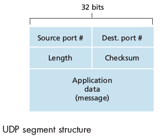

The UDP header has only four fields, each consisting of two bytes: 
 - `source port number`
 - `destination port number`
 - `checksum` (used for error detection.)
 - `length` (which specifies the number of bytes in the UDP segment, header + data)
 
This `length` field is needed since the size of the data field may differ from one UDP segment to the next.

### 3.3.2 UDP Checksum
Provides for error detection, to determine whether the bits in the segment have been altered as it moves from source to destination.

At the send side, UDP performs the 1s complement of the sum of all the 16-bit (max 64) words in the segment, with any overflow encountered during the sum being wrapped around. This result is put in the checksum field of the UDP segment header.

UDP implements error detection according to the **end-end principle**: certain functionality (error detection in this case) must be implemented on an end-end basis: "functions placed at the lower levels may be redundant or of little value when compared to the cost of providing them at the higher level".

## 3.4 Principles of Reliable Data Transfer
It is the responsibility of a **realiable data transfer protocol** to implement reliable data service: no transferred data bits are corrupted or lost and all are delivered in the order in which they were sent.
We will consider the following actions:

 - The sending side of the data transfer protocol will be invoked from above by a call to `rdt_send()`
 - On the receiving side `rdt_rcv()` will be called when a packet arrives while `deliver_data()` will be called when the `rdt` protocol wants to deliver data to the upper layer.

We use the term packet rather than segment because the concepts explained here applies to computer networks in general.
We will only consider the case of **unidirectional data transfer** that is data transfer from the sending to the receiving side. The case of reliable **bidirectional** (full-duplex) **data transfer** is not more difficult but more tedious to explain. Nonetheless sending and receiving side will need to transmit packets in *both directions*.

### 3.4.1 Building a Reliable Data Transfer Protocol
**Finite-state machine**s (FSM) are boring! And unlikely to be asked at the exam, therefore I decided not to cover them here.

### 3.4.2 Pipelined Reliable Data Transfer Protocols
In today's high-speed networks stop-and-wait protocols are simply not tolerable: we  cannot send one packet and wait for the ACK and then send the second one, it is inefficient as we can see computing the **utilization of the channel**:

$$ U = \frac{L/R}{RTT+ L/R} $$

The solution is simple: rather than operate in a stop-and-wait manner, the sender is allowed to send multiple packets without waiting for acknowledgements. Since the many in-transit send-to-receiver packets can be visualized as filling a pipeline, this technique is known as **pipelining**.

Some consequences:

 - The range of sequence numbers must be increased: **each in-transit packet must have a unique sequence number**
 - Sender and receiver may have to buffer more than one packet.

Two basic approaches toward pipelined error recovery can be identified: **Go-Back-N** and **Selective Repeat**

### 3.4.3 Go-Back-N (GBN)
The sender is allowed to send N packets (**sender window size = N**), the receiver has a window of size **1**.
If a segment from sender to receiver is lost, the receiver discards all the segments with sequence number greater than the sequence number of the dropped packet, answering with ACK with this sequence number. (no packet re-ordering)
The sender will wait for ACK in order to move the window and send new packets. The wait is not infinite, after a certain time a timeout will occur and the sender will retransmit all the packets in the sending window.
In a Go-Back-N protocol, acknowledgements are **cumulative**: if sender receives ACK3 he will know that all the packets from 0 to 3 have been received, even if hasn't received ACK2.

### 3.4.4 Selective Repeat
When the window-size and bandwidth-delay product are both large, many packets can be in the pipeline and a single packet error can thus cause GBN to retransmit a large number of packets, many unnecessarily.
**Selective Repeat** avoid unnecessary retransmissions by having the sender retransmit only those that packets it suspects were received in error at the receiver:
**individual acknowledgements** (opposed to cumulative).
**sender window size = N** and **receiver window site = N**.
The sender has a timer for each packet in its window. When a timeout occurs, only the missing packet is resent.
The receiver buffers out of order packets.

## 3.5 Conncetion-Oriented Transport: TCP
### 3.5.1 The TCP Connection
TCP is said to be **connection-oriented** because before one application process can begin to send data to another, the two processes must first "handshake" with each other. During the connection establishment, both sides of the connection will initialize many TCP state variables.
TCP connection is not an end-to-end TDM or FDM circuit nor is it a virtual circuit as **the connection state resides entirely in the two end systems** and not in the intermediate network elements.
A TCP connection provides a **full-duplex service**: when a connection between process A and process B, application layer data can flow from A to B and, at the same time, from B to A.
TCP is also **point-to-point**: a connection is always  between a *single sender* and a *single receiver*, no multicast possible.

Establishment of the connection: the client first sends a special TCP segment, the server responds with a second special TCP segment and the client answer again with a third special TCP segment. The first two cannot contain a payload while the third can. Three segments: **three-way handshake**.
Both the sender and the receiver have buffers that are set up during the handshake.
The maximum amount if data that can be grabbed and placed in a segment is limited by the **maximum segment size (MSS)**.
TCP therefore splits data into smaller chunks and pairs each chunk of client data with a TCP header thereby forming **TCP segments** which are passed down to the network layer. When TCP receives a segment at the other end, the segment's data is placed in the TCP connection's receive buffer. **Each side of the connection has its own send buffer and its own receive buffer**

### 3.5.2 TCP Segment Structure

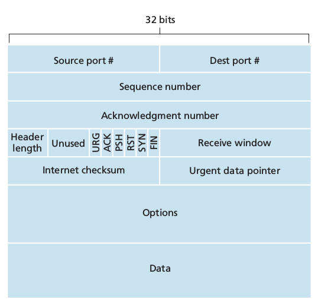

 - 32 bit sequence number and acknowledgement number necessary for reliable data transmission
 - 16 bit **receive window** used for flow control, indicates the number of bytes that a receiver is willing to accept
 - 4 bit **header length field**. The TCP header can be of a variable length due to the TCP options field (usually empty therefore usual length is 20 bytes)
 - **options field** used to negotiate MSS or as a window scaling factor for use in high speed networks.
 - **flag field**: 6 bits:
 	1. ACK used to indicate that the value carried in the acknowledgement field is valid, that is the segment contains an acknowledgement for a segment that has been successfully received.
	2. ,  3. and 4. **RST, SYN, FIN** for connection setup and teardown
	5. **PSH** indicates that the receiver should pass the data to upper layer immediately
	6. URG indicates that there is data in the segment that the sending side upper layer has marked as urgent.

#### Sequence Numbers and Acknowledgment Numbers
TCP views data as *an unstructured, but ordered, stream of bytes* and TCP's use of sequence numbers reflects this view: sequence numbers are over the stream of bytes and not over the series of transmitted segments.
The **sequence number for a segment** is the byte-stream number of the first byte in the segment.
EX 500,000 bytes, MSS = 1,000 bytes => 500 segments are created. First is numbered 0, second 1000, third 2000.....

**The acknowledgement number** *that Host A puts in its segment is the sequence number of the next byte Host A is expecting from Host B*.
TCP is said to provide **cumulative acknowledgements**: if sender receives ACK 536 he will know that all the bytes from 0 to 535 have been well received.
What does a host do when it receives out-of-order segments? The receiver buffers the out-of-order bytes and waits for the missing bytes to fill in the gaps.
Usually both sides of a TCP connection randomly choose an initial sequence number **randomly** both for security and for minimizing the possibility that a segment that is still present in the network from an earlier, already terminated connection between two hosts is mistaken for a valid segment in a later connection between these same two hosts.

### 3.5.3 Round-Trip Time Estimation and Timeout

TCP uses a timeout/retransmit mechanism to recover from lost segments. The question rises: How long should the timeout intervals be?
Clearly the timeout should be larger than the connection's round-trip time? How much larger? How can the RTT be evaluated?

#### Estimating the Round-Trip Time
The sample RTT, `SampleRTT`, for a segment is the amount of time between when the segment is sent (passed to network layer) and when an acknowledgement for the segment is received.
Most TCP implementations take one `SampleRTT` at a time: at any point in time, the `SampleRTT` is being estimated for only one of the transmitted but currently unacknowledged segments, leading to a *new value of `SampleRTT` for approximatively every RTT*.
TCP **never computes a `SampleRTT` for a segment that has been retransmitted**, only for segments transmitted once.
In order to estimate a typical RTT, TCP keeps an average called `EstimatedRTT` of the `SampleRTT` values. Upon obtaining a new `SampleRTT` TCP updates this estimation according to the formula:

`EstimatedRTT = (1 - a) * EstimatedRTT + a * SampleRTT`

 where usually a = 1/8 = 0.125

We note that this weighted average puts more weight on recent samples than on old samples. In statistics such an average is called an **exponential weighted moving average (EWMA)**.
It is also useful to having an estimate of the *variability of the RTT*. We can measure how much `SampleRTT` typically deviates from `EstimatedRTT`:

`DevRTT = (1 - b) * DevRTT + b* | SampleRTT - EstimatedRTT |`

We note that this is an EWMA of the difference of estimated and last measured RTT. The recommended value for b is b = 0.25

#### Setting and Managing the Retransmission Timeout Interval

`TimeoutInterval = EstimatedRTT + 4 * DevRTT`

An initial `TimeoutInterval` value of 1 second is recommended.
Also **when a timeout occurs, the value of `TimeoutInterval` is doubled** in order to avoid a premature timeout occurring for a subsequent segment that will soon be acknowledged. As soon as a segment is received and `EstimatedRTT` is updated, the `TimeoutInterval` is again computed using the formula above.

### 3.5.4 Reliable Data Transfer
TCP creates a **reliable data transfer service** on top of IP's unreliable best-effort service. It ensures that the data stream that a process reads out of its TCP receive buffer is *uncorrupted, without gaps, without duplication and in sequence*.
We supposed until now that an individual timer was associated with each transmitted segment. However timer management can require considerable overhead. Thus the recommended TCP timer management procedures (defined by RFC standards) use only a ***single*** retransmission timer (it is helpful to think of the timer as being *associated with the oldest unacknowledged segment*).

 1. Upon receiving data from the application layer, TCP encapsulates it in a segment and passes to the segment to IP. If the timer is not running for some other segment, TCP starts it when the segment is passed to IP, the timer expiration interval being `TimeoutInterval`
 2. If the timeout occurs, TCP responds by **retransmitting the segment that caused the timeout** and by restarting the timer
 3. An valid acknowledgement segment is received: TCP compares the ACK `y` value with its `sendBase` (the sequence number of the oldest unacknowledged byte). If `y > sendBase` then ACK is acknowledging one or more previously unacknowledged segments (cumulative acknowledgement). The `sendBase` variable is updated and the timer is restarted if there are not-yet-acknowledged segments.

#### Doubling the Timeout Interval

Each time TCP retransmits, it sets the next timeout interval to twice the prevous value. However when the timer is restarted after receiving data from the application layer or after receiving an ACK, the `TimeoutInterval` is recomputed as described previously

#### Fast Retransmit
The problem with timeout-triggered retransmission is that the timeout period can be relatively long.
The sender can however often detect packet loss before the timeout event occurs by noting *duplicate ACKs*. A **duplicate ACK** is an ACK that reacknowledges a segment for which the sender has already received an earlier acknowledgement.
When the TCP sender receives **three duplicate ACK for the same data** it takes this as an indication that the segment following the segment that has been ACKed three times has been lost. In the case that three duplicate ACKs are received, the TCP sender performs a **fast restransmit**: it retransmits the missing segment *before* that segment's timer expires.

#### Go-Back-N or Selective Repeat?
Acknowledgments are cumulative (GBN) but many TCP implementations will buffer correctly received but out-of-order segments.
Also consider fast retransmit where only the missing packet is resent (SR) instead of all the window (GBN).
We can see that TCP's error recovery mechanism is categorized as a **hybdrid of GB and SR protocols**.

### 3.5.5 Flow Control
The host on each side of a TCP connection set aside a receive buffer for the connection. When TCP receives bytes that are correct and in sequence, it places the data in the receive buffer. The associated application process will read data from this buffer, but necessarily at the instant the data arrives (busy, not interested...). Thus the *the sender can easily overflow the connection's receive bufffer by sending too much data too quickly*. To avoid this event, TCP provides a **flow-control service**.
Flow control is a *speed-matching service*: matching the rate at which the sender is sending against the rate at which the receiving application is reading.

**Flow control and congestion control are not the same!**: the former preventing overflow at the receiver side and being actuated only by the two end points, the latter preventing congestion of the network.

TCP provides flow control by having the *sender* maintain a variable called the **receive window**, used to give the sender an idea of how much free buffer space is available at the receiver.

Host A sends a large file to Host B over TCP.

##### B side

	1. B allocates a receive buffer to its connection, its size being `RcvBuffer`
	2. B also keeps the variables: `LastByteRead` (number of last byte in the data stream read by the application process) and `LastByteRcvd` (the number of the last byte arrived from the network and placed in the receive buffer)

We have: `LastByteRcvd - LastByteRead <= RcvBuffer` (we don't want overflow!)

Receive window aka the *amount of spare room in the buffer* `rwnd = RcvBuffer -  [LastByteRcvd - LastByteRead]`
`rwnd` is dynamic

##### A side
A keeps track of two variables:

	1. `LastByteSent`
	2. `LastByteAcked`

Through the connection's life A must make sure that `LastByteSent - LastByteSent <= rwnd`

If B's buffer becomes full, he sends `rwnd = 0`.  If *B has nothing to send to A*, when the application process empties B's buffer, TCP does not send a new segment with the new value of `rwnd` to A (TCP sends to A only if it needs to send data or if it needs to send an ACK).
Therefore A is never informed that B's buffer has some free space and **he is blocked and can trasmit no more data**.
To solve this problem, TCP requires A to **continue to send segments with one data byte when B's receive window is 0**, these segments will be acknowledged by B. Eventually the buffer will begin to empty and the acknowledgements will contain à non-zero `rwnd` value.

We remember that **UDP has no flow control service**

### 3.5.6 TCP Connection Management
#### How is the connection established? **Three-way handshake**

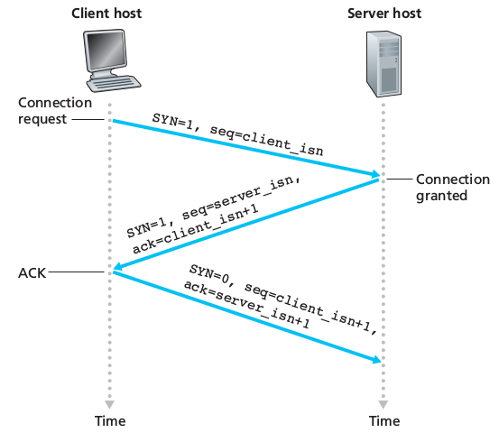

 1. The client-side TCP sends a special TCP segment to server-side TCP. This segment **doesn't contain any application-layer data** but the **flag bit SYN is set to 1**. The segment is referred to as a *SYN segment*. The client also **randomly chooses an initial sequence number** (`client_isn`) and **puts this number in the sequence number field of the initial TCP SYN segment**. (randomizing `client_isn` is interesting to avoid security attacks).
 2. The TCP SYN segment arrives at the server-side, it is extracted from the datagram. The server allocates the TCP buffers and variables to the connection and **sends a connection-granted segment to the client**. This segment also contains no application-layer data. The **SYN flag is set to 1**, the **ACK field in the header is set to `client_isn+1`**. **The server chooses its own initial sequence number `server_isn`** and **puts this value in the sequence number field of the TCP segment header**. This segment is referred to as *SYNACK segment*.
 3. Upon receiving the SYNACK segment, the client also allocates buffers and variables to the connection. The client then **sends the server yet another segment which acknowledges the SYNACK** (`server_isn+1` is set the acknowledgement field of the TCP segment header)

After this setup, all the segments will have the SYN bit set to 0 in their headers.

#### Tearing down a TCP connection

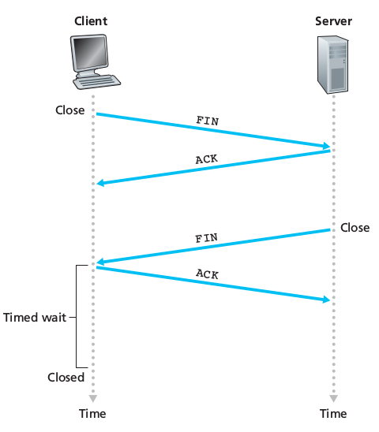

The client decides to end the connection:

 1. The client sends a special TCP segment to the server, this special segment having the **FIN bit flag set to 1** in the header.
 2. The server receives the segment and sends an acknowledgement to the client.
 3. The server then sends its own shutdown segment which also **has the FIN bit set to 1**
 4. The client acknowledges the server's shutdown segment.
 5. The "resources" (buffers and variables) in the host**s** are deallocated.

#### What if the two ends are not ready for communication?
 A host receives a TCP segment whose port number or source IP address do not match with any of the ongoing sockets in the host -> the host sends a special reset segment to the source (RST flag bit set to 1) and drops the packet (UDP does responds with a special ICMP datagram)

## 3.6 Principles of Congestion Control

### 3.6.1 The Causes and the Costs of Congestion

#### Scenario 1: Two Senders, A Router with Infinite Buffers
A -> D, B -> C, A and B connect to the Internet through the same router, B and C connect to the Internet through the same router
(pas envie)


## 3.7 TCP Congestion Control
TCP limits the rate at which it sends traffic into its connection as a function of perceived network congestion.
The TCP congestion-control mechanism operating at the sender keeps track of an additional variable: the **congestion window**, noted `cwnd` which imposes a constraint on the rate at which a TCP sender can send traffic into the network. Specifically: `LastByteSent - LastByteAcked <= min{cwnd, rwnd}`.
Limiting the amount of unacknowledged data at the sender we can limit the sender's send rate.
At the beginning of each RTT the sender sends `cwnd` bytes of data and at the end of the RTT he acknowledges. Thus **the sender's send rate is roughly `cwnd/RTT` bytes/sec. Adjusting the value of `cwnd` the sender can adjust the rate at which it sends data into the connection**.
Let now consider a *loss event* (timeout OR three duplicate ACKs). When there is excessive congestion some router buffers along the path overflows, causing a loss event at the sender *which is taken by the sender to be an indication of congestion on the sender-to-receiver path*.
If there is no congestion then all the acknowledgements will be received at the sender, which will take these arrivals as an indication that segments have been received and that he can increase the congestion window size and hence its transmission rate. If acknowledgements arrive at a slow rate then the congestion window will be increased at a relatively slow rate and, viceversa, it will be increased more quickly if ACKs arrive at a high rate.
Because TCP uses acknowledgements to trigger (or clock) its increase in congestion window size, TCP is said to be **self-clocking**. TCP uses the principles:

 1. *A lost segment implies congestion therefore the sender rate should be decreased.*
 2. *An acknowledged segment means the network's working, therefore the sender's rate can be increased* (if ACK of unacknowledged segment)
 3. *Bandwidth probing*: the transmission rates increases with ACKs and decreases with loss events: TCP is continuously checking (probing) the congestion state of the network

### TCP Congestion-Control Algorithm
Three components :

#### 1 - Slow Start
When a TCP connection begins, `cwnd` is usually initialized to a small value of 1 MSS and only one segment is sent. **Each acknowledged packet** will cause the `cwnd` to be increased by 1 MSS and the sender will send now two segments (because the window is increased by one for each ack).
Therefore the number of segments doubles at each RTT, therefore the sending rate also doubles every RTT. Thus TCP send rate **starts slow but grows exponentially during the slow start phase**.
When does the growth end?

 - Timeout: `cwnd` is set to 1 MSS and the slow start is started anew. Also the variable slow start threshold is initialized:
 `ssthresh = cwnd / 2 - (half of value of cwnd when congestion is detected)`
 - When `cwnd >= ssthresh` slow starts is stopped -> congestion avoidance state
 - Three duplicate ACKs: fast retransmit and fast recovery state

#### 2 - Congestion Avoidance
TCP suppose congestion is present, how to adapt?
Instead of doubling `cwnd` every RTT, `cwnd` is increased **by just a single MSS every RTT**.
When should this linear increase stop?

 - Timeout: `cwnd` is set to 1 MSS, and `ssthresh = cwnd (when loss happened) / 2`
 - Three duplicate ACKs: `cwnd = (cwnd / 2) + 3 MSS` and `ssthresh = cwnd (when 3 ACKs received) / 2` -> fast recovery state

#### 3 - Fast Recovery
`cwnd` is increased by 1 MSS for every duplicate ACK received for the missing state that caused TCP to enter this state. When the ACK arrives for the missing segment, TCP goes into Congestion Avoidance after reducing `cwnd`.
If a timeout occurs `cwnd` is set to 1 MSS and `ssthresh` is set to half the value of `cwnd` when the loss event occurred.
Fast recovery is recommended but not required in TCP, in fact only the newer version of TCP, **TCP Reno** incorporated fast recovery.

#### Macroscopic Description of TCP Throughput
What is the average throughput (average rate) of a long-lived TCP connection?
Ignoring the slow start phase (usually very short as the rate grows exponentially). When the window size is *w* the transmission rate is roughly *w*/RTT. *w* is increased by 1 MSS each RTT until a loss event.
Denote by *W* the value of *w* when a loss event occurs. Then we have

average throughput of a connection = (0.75 * W)/RTT

#### TCP Over High-Bandwidth Paths
Today's high speed links allow to have huge windows. What happens if one of the segments in the window gets lost? What fraction of the transmitted segments could be lost that would allow the TCP congestion control to achieve the desired rate?

average throughput of a connection = (1.22 * MSS)/(RTT * sqrt(L))

Where L is the loss rate

# Chapter 4: The Network Layer
In the chapter, there is an important distinction between the **routing** and **forwarding** functions of the network layer. Forwarding involves the transfer of a packet from an incoming link to an outgoing link *within a single router* while routing involves *all of a network's routers* whose collective interactions via routing protocols determine the paths that packets take on their trips from source to destination.

## 4.1 Introduction
The primary role of routers is to forward datagrams from input links to output links. Routers do not run nor the application-layer or the transport-layer, they go only up until the network layer.

### 4.1.1 Forwarding and Routing
The role of the network layer is deceptively simple: **to move packets from a sending hosts to a receiving host**. To do so it performs two important functions:

 - ***Forwarding***: When a packet arrives to a router's input link, the router must move the packet to the appropriate output link. It is an action **local** to the router
 - ***Routing***: The network layer must determine the route or path taken by packets as they flow from a sender to a receiver. The algorithms that calculate these paths are referred to as **routing algorithsm**. It is a **network-wide** action

Every router has a **forwarding table**. When a router receives a packet, it extracts a value from a specific field in the header and searches for that value in in the forwarding table.
The procedure used to set up and update the table depends on the protocol used. However a router receives and sends *routing protocol messages* to configure its forwarding table.

We also need to mark the distinction between routers and *packet switches*.

 - Packet-switches: performs forwarding according to the value in a field in the header of the packet. Some packet switches called **link-layer switches** base their forwarding decisions on values in the fields of the *link-layer frame* (link-layer devices)
 - Routers: base forwarding decisions on the value in the network-layer field. (network-layer devices) but also must implement link layer (no 3 without 2)

#### Connection Setup
in some computer networks there is a third really important networks-layer function: **connection setup**: a **path-wide** process that sets up connection state in routers.

### 4.1.2 Network Service Models
The **network service model** defines the characteristics of end-to-end transport of packets between sending and receiving end systems. Some possible service for a network layer:

 1. Sending side:
	 - *Guaranteed delivery*
	 - *Guaranteed delivery with bounded delay*
 2. Flow and receiving side:
	- *In-order packet delivery*
	- *Guaranteed minimal bandwidth*
	- *Guaranteed maximum jitter* (amount of time between transmission of two successive packets at the sender side is equal to the amount of time between their receipt at the destination, or that this spacing changes by no more than some specified value)
	- *Security services*: encryption for confidentiality, data integrity and source authentication

**The Internet's network layer doesn't provide any of these**: it provides a **best-effort service** there are no timing or bandwidth guarantees, no loss or order guarantees and congestion control indications.

## 4.2 Virtual  Circuit and Datagrams Networks
As in transport layer, the network layer can use connection or connection-less protocols. There however some differences with the transport layer:

 - In the network layer these services are **host-to-host** services (not the case for the TL, just look at TCP)
 - The network layer provides either a host-to-host connectionless service or a host-to-host connection service **but no both**. Connection service -> **Virtual-Circuit (VC) networks**, Connectionless service -> **datagram networks**

### 4.2.1 Virtual-Circuit Networks
The Internet is a datagram network but many alternative network architectures (ATM) are virtual-circuit networks. The connections in VC are called **virtual circuits (VCs)3*.
A VC consists of

 1. A source-to-destination *path*
 2. VC numbers, one for each link along the path
 3. Entries in the forwarding table in each router along the path

A packet belonging to a virtual circuit will carry a VC number in its header. Because a VC may have different VC numbers on each link, each router must replace the VC number of traversing packets with a new VC number, which is obtained from the forwarding table. How is this determined?
Whenever a VC is established across a router, an entry is added to the forwarding table, and one (corresponding to the terminating VC) is removed whenever a VC ends.
The routers must maintain **connection state information** for the ongoing connections (using the tablea). There are 3 phases in a VC:

 - *VC Setup*: sending side contacts networks layer specifying the IP address of the destination. The network sets up the VC. The path is determined as well as the VC number for each link along the path. The forwarding tables are updated and resources reserved.
 - *Data transfer*: the packets flow
 - *VC teardown*: The call termination propagates along the path, the forwarding tables are updated

During network-layer setup *all the routers along the path between source and destination are involved in VC setup, and each router is fully aware of all VCs passing through it* (not in TCP: setup and connection only between source and destination).
The messages used by end ssystems to initiate or terminate a VC are called **signaling messages** and the protocols used to exchange them are called **signaling protocols**.

### 4.2.2 Datagram Networks
Each time an end system wants to send a packet, it sampts the packet with the address of the destination end system and pops the packet into the network. The routers along the path will use this address to forward it.
The router has a forward table that *maps destination addresses to link interfaces*. When a packet arrives, it reads the destination address, uses the table to determine what link to use, and forwards the packet to that output link interface.

If we consider IPv4, addresses are 32 bits long. To avoid having tables with 2^32 entries, routers use **prefixes**. When there are multiple mathces to one address, the router uses the **longest prefix matching rule**.

Although routers in datagram networks maintain no connection state information, they nevertheless maintain forwarding state information in their forwarding tables.

### 4.2.3 Origins of VC and Datagram Networks
VC has its roots in the telephony world, which uses circuits switching too.
The datagram model instead comes from the need to simplify as much as possible the network to bring computers together.

## 4.3 What's Inside a Router?

 - *Input ports*: performs the physical layer functions of incoming link at the router. It is also here that the forwarding table is consulted to determine the output port to which the arriving packet will be forwarded via the switching fabric. Control packets (protocol info) are forwarded to the routing processor.
 - *Switching fabric*: connects input prots to output ports.
 - *Output ports*: stores packets received from the switching fabric and performs the necessary link layer and physical layer functions.
 - *Routing processor*: executes the routing protocols (algorithms), maintains routing tables and attached link state information and computes the forwarding table for the router.

Input ports, switching fabric and output ports implement the forwarding function and are almost always implemented in hardware (*routing forwarding plane hardware*) while the routing processor implements the routing function and is usually implemented in software running on traditional CPU (*router control plane*)

### 4.3.1 Input Processing
The packet arrives and the link and phyisical layer unpacking functions are performed. The forwarding table is computed and updated by the routing processor with a shadow copy typically stored at each input port so that forwarding decision can be made locallly without invoking the centralized routing processor on a per packet basis and thus avoiding a centralized processing bottleneck. The table is transferred to ports through separated bus. The lookup is then just a search (implemented in hardware and using high performance algorithms), speed also depends on the memory technology (DRAM, SRAM...). Lookup is important but input processing also consists of

 - physical and link layer processing
 - chekcing the packet's version number, checksum, time to live....
 - updating counters for network management.

Input ports than moves the packet to the switching fabric (eventually queuing them if this is busy)

### 4.3.2 Switching
Can be performed in different ways:

#### Switching via memory
Switching under the control of the CPU and input and output ports functioned as traditional I/O devices in a traditional operating system. The packet arrives, is copied into the processor memory, the processor determines the output port and copies the packet to the output port's buffer.
No parallel forwarding (only 1 memory read/write bus)

#### Switching via a bus
An input port transfers a packet directly to the output port over a shared bus without intervention by the routing processor. The input port pre-pends an internal header to the packet. All the output ports receive the packet but only the one that matches the label in the internal header will keep the packet. The output port will remove this internal header. The switching speed is limited to the bus speed as one packet at a time can cross the bus (multiple arriving packets will have to wait). Sufficient only for small area and enterprise networks

#### Switching via an interconnected network
To overcome the bandwidth limitation of a single shared bus a more sophisticated interconnection network can be used.
A *crossbar switch* is an interconnection network consisting of 2N buses that connect N input ports to N output ports. Each vertical bus intersects each horizontal bus at a crosspoint which can be opened or closed at any time by the switch fabric controller. If a packet has to go from input X to output Y, only the crosspoint between the horizontal bus from X and the vertical bus to Y will be closed.
Thus packets directed to different output ports can be forwarded simultaneously, but not multiple packets directed to the same output port.

### 4.3.3 Output Processing
takes packets stored in the output's port's memory and transmits them over the output link, thus selecting de dequeuing packets for transmission and performing the necessary link and physical layer transmission functions.

### 4.3.4 Where Does Queuing Occur?
Queues may form at both the input ports and the output ports. The location and the extent of queuing will depend on traffic load, speed of the switching fabric, and line speed. As the queues grow large, the router's memory can eventually be exhausted and **packet loss** will occur. IS THIS USEFUL ? NOT COVERED BY TEACHER

## 4.4 The Internet Protocol (IP): Forwarding and Addressing in the Internet
We know move to study of the network layer in the Internet. There are two versions of the IP (Internet Protocol) in use today: IPv4 and IPv6.
There 3 main components in the Internet: the IP Protocol (addressing, datagram format and packet handling conventions), the routing protocol (path selection), the Internet Control Message Protocol (ICMP) (error reporting and network information).

### 4.4.1 Datagram Format
A network layer packet is referred to as a **datagram**.

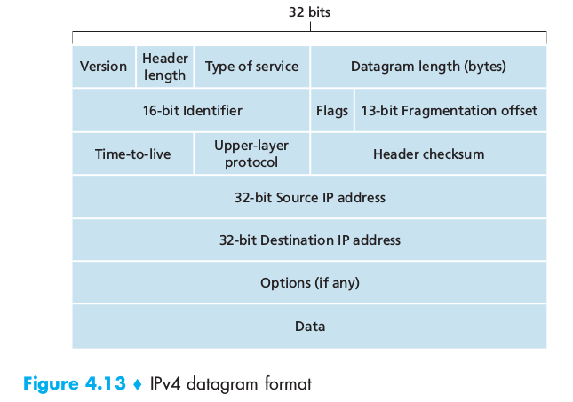

Some fields:

 - *Version number*: 4 bits specifying the IP protocol version of the datagram (IPv4 or IPv6 )
 - *Header length*: the length of the packet is variable therefore this field tells where the header ends and the data begins. Usually datagrams contain no option so that the typical IP datagram has **20-byte header**
 - *Type of service* (TOS): allows different types of datagrams to be distinguished from each other. (eg real time vs non real time)
 - *Datagram length*: 16 bits specifying the total length, that is header + data measured in bytes. 16 bits -> max header length = 65535 bytes, but usually datagrams are rarely larger than 1500 bytes.
 - *Identifier, flags, fragmentation offset*: used for IP fragmentation. (NB: IPv6 doesn't allow fragmentation at routers)
 - *Time-to-live* (TTL): used to avoid that datagrams circulate forever. It is decreased by one each time the datagram is processed by a router. When TTL = 0, the datagram is dropped
 - *Protocol*: only used when datagram reaches its final destination, it specifies what *transport protocol* to which the data of the datagram should be passed. EX: 6 -> TCP, 17 -> UDP
 - *Header checksum*: helps the router to detect bit errors in a received IP datagram. Computation: each two bytes in the **header** are considered as numbers, summed up using the 1s complement arithmetic. The 1s complement of this sum is then put in the checksum field. A router computes the checksum for each datagram. If the computed one doesn't equal the one in the field then the router has detected an error. Usually the datagram is discarded. As it is recomputed at each router, it may change.
 - *Source and destination IP addresses*
 - *Options*: rarely used, dropped by IPv6
 - *Data (payload)*: usually contains the transport layer segment but can also contain ICMP messages

#### IP Datagram Fragmentation
The maximum amount of data that a link layer can carry is called the **Maximum Transmission Unit (MTU)**. As each datagram is encapsulated in a link layer frame, the MTU imposes a hard limit on the length of the datagram. Each of the links along the route can use different link-layer protocols and therefore can have different MTU.
We therefore have to break the IP datagram into smaller datagrams, each of which will go in different link layer frames. Each of these smaller datagrams is referred to as a **fragment**.
A fragment must be reassembled before it can be passed to the transport layer. To reduce the workload on routers, the designers of IPv4 decided that reassembling should only be done at the destination end system.

In IPv4, to comply with fragmentation, the header contains the fields:
 - *Identifiers*: identifies the **unfragmented datagram** (same for all fragments)
 - *flags*: in particular there is one flag set to 0 if the fragment is the last or to 1 if there are more to come
 - *fragmentation offset*: an integer x, the data in the fragment should be inserted beginning at byte x * 8

If one fragment contains error or is lost, all the others are dropped and TCP will have the sender retransmit all the data.
Fragmentation complicates the network and end systems and can be used in lethal DoS attacks such as the Jolt2 attack

### 4.4.2 IPv4 Addressing
The boundary between the host and the physical link is called an **interface**. A router has multiple links connected to it, therefore multiple interfaces and therefore a router has multiple IP addresses and *an IP address is technically associated with an interface rather than with a host or router*.
IPv4 addresses are 32 bits long (4 bytes) -> max 2^32 possible addresses. They are typically writen in **dotted decimal notation** where each byte of the address is written in deciaml from and separated by a period from the others.
EX 193.32.216.9 === 11000001 00100000 11011000 00001001
Each interface on every host (except host behind NATs) must have a unique IP address. How are these computed?
A portion is determined by the subnet to which the host is connected.
A subnet is the portion of the network interconnected end systems and one one router. (also called *IP network* or *network*). IP assigns an address to a subnet x.x.x.x/y where /y notation, sometimes known as a **subnet mask** indicates *that the leftmost y bits of the 32 bit quantity define the subnet address*. If y is 24, then any host attached to the a.a.a.0/24 subnet would be *required* to have an address of the form a.a.a.xxx.

FIGURE 4.17 WTF

The Internet's address assignment strategy is known as **Classless Interdomain Routing (CIDR)**. It generalizes the notion of subnet addressing. Consider a.b.c.d/x : the x most significant bits constitute the network portion of the IP address and are often referred to as the **prefix** (or *network prefix*). EX an organization is assigned a block of contiguous addresses, that is, a range of addresses with a common prefix.
When someone outside the organization want to send a datagram to someone inside, he will only need this x bits. The remaining 32-x bits can be thought of as distinguishing among the devices within the organization. These bits may have an additional subnetting structure.
There is yet another type of IP address, the *IP broadcast address 255.255.255.255*. When a datagram is sent to this address, the datagram is delivered to all hosts on the same subnet.

#### Obtaining a Block of Addresses
A network administrator contacts an ISP which would provide a partition of the addresses that had already been allocated to him.
EX ISP has 200.23.16.0/20, it splits in 8 equal sized blocks: 200.23.16.0/23, 200.23.18.0/23, 200.23.20.0/23, ..., 200.23.30.0/23
Who assigns set of addresses to ISPs? The ***Internet Corporation for Assigned Names and Numbers (ICANN)*** which allocates IP addresses, manages DNS root servers, assigns domain names and solves domain name disputes.

#### Obtaining a Host Address: The Dynamic Host Configuration Protocol
Once an organization has obtained a block of addresses, it can assign individual IP addresses to the hosts and router interfaces which are part of it. This can be done either **manually** (by the network administrator) or automatically by the **Dynamic Host Configuration Protocol (DHCP)**.
It can be configured so that a host receives the same IP each time it connects to the network or a temporary IP addresses that will change upon each connection. DHCP also transmits to hosts additional information (subnet mask, address of first-hop = default gateway, address of local DNS server).
As it automates the connection of a host into the network, DHCP is often referred to as a **plug-and-play protocol**. It is also popular in *wireless LANs where hosts join and leave frequently and in *residential ISP access networks*.
DHCP is a *client-server protocol*, the client being a newly arriving host needing network configuration information and the server being a router or a *DHCP relay agent* that know the address of a DHCP server for that network.
For a new client there is a 4 step process i nthe DHCP protcol:

 1. *DHCP server discovery* c (client) looks for a server sending **DHCP discover message** a UDP packet directed to port 67. This segment is encapsulated in datagram sent to 255.255.255.255 (broadcast address) from address 0.0.0.0
 2. *DHCP server offer(s)* s (server) replies with a **DHCP offer message** broadcast to all nodes on the subnet using (sent to 255.255.255.0). c may receiver many of these (more servers) containing the transaction ID, proposed IP address and an address lease time (amout of time for which the address will be valid)
 3. *DHCP request*: c chooses one offer and responds to s with a **DHCP request message** echoing back the configuration parameters
 4. *DHCP ACK* s responds with **DHCP ACK message** confirming

DHCP also provides a mechanism for renewing the lease on an address.

#### Network Address Translation (NAT)
Every IP-capable device needs an IP address. The number of connected devices grows fast, how to deal with IPv4 address space exhaustion?
**Network Address Translation (NAT)**
The NAT-enabled router defines a **realm** (or private network) (a network whose addresses only have meaning to devices within that network) and it can use the whole 32 bit address space for devices connected to it, it will also have a public address used to communicate with the exterior. The picture is explicative.

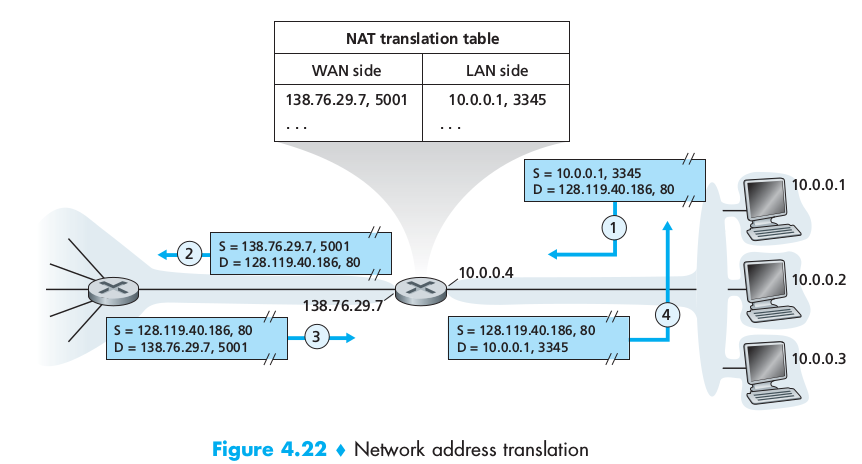

From the outside the router looks like a single device with a single IP address. It hides the details of the internal network from the outside world. Internal addresses can be assigned using DHCP.

Problems with NAT:

 - Port number should be used for addressingi processes not hosts
 - Routers shouldn't have access to the transport layer (ports)
 - NAT violates end-to-end argument (any host should be able to contact any other host)
 - NAT interferes with P2P applications (peers hidden by NAT), therefore the need of **connection reversal** for **NAT traversal**

#### UPnP
NAT traversal is increasingly provided by Universal Plug and Play. It requires both the host and the NAT to be compatible. Host requests a NAT mapping_
*(private IP address, private port number) -> (public IP address, public port number)*
If the NAT accepts and creates the mapping, then outsiders can create connections to (public IP address, public port number).

### 4.4.3 Internet Control Message Protocol
ICMP is used to communicate network-layer information between hosts and routers, usually for error reporting (ex Destination network unreachable).
ICMP is considered part of IP but architecturally lies just above IP as ICMP messages are carried inside IP datagrams as payloads.
ICMP have a type and a code field and carry the header and the first 8 bytes of the datagram that caused the message to be generated in the first place.
Ping and traceroute are implemented using ICMP messages

#### Inspecting datagrams: firewalls and intrusion detection systems
Firewalls inspect the datagram and segment header fields denying suspicious datagrams entry into the internal network. Firewalls can block ICMP packages or packets based on port numbers, addresses.
Additional protection can be provided by IDS, placed at the boundary of the network, performs *deep packet inspection* examining not only headers but also payloads (including application layer data). IDS have databases of packet signatures that are know to be dangerous. As packets flow through the IDS, it tries to match them to signatures in its database, if a match is found, an alert is created. IPS (intrusion prevention system) in addition to detecting, also blocks packets raising alerts.

### 4.4.4 IPv6
Developed because of IPv4 address space exhaustion

#### Datagram format

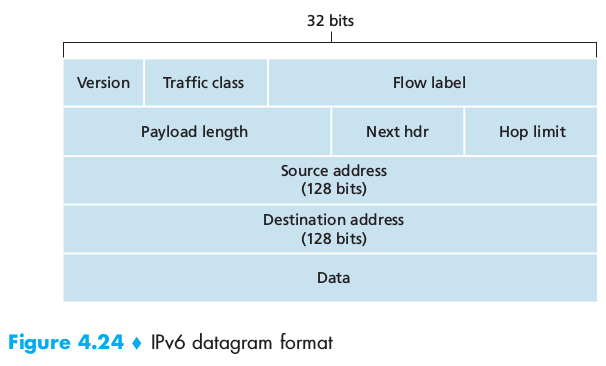

 - the size of the source and destination addresses is increased **from 32 to 128 bits**: every grain of sand on the planet can be addressable.
Unicast and multicast addresses are joind by the **anycast address** which allow a datagram to be delivered to any one of a group of hosts.
 - A number of IPv4 fields have been dropped or made optional resulting in a **40-byte fixed-length header** which allows faster datagram processing.
 - *Flow label* not clear definition. 20-bit
 - *Version*: 4-bit for IPv6 or 4. If ipv6 -> 0110
 - *Traffic class*: 8 bit similar to TOS
 - *Payload length*: 16 bit unsigned integer indicating number of bytes following the 40-byte datagram header
 - *Next header*: transport layer protocol
 - *Hop limit*: decremented by one by each router forwarding the datagram, when 0, the datagram is discarded


Fragmentation and reassembly cannot be done by intermediate routers, only by source and destination. If a router cannot trasmit a datagram because too big, it drops it and sends back an ICMP error message "Packet too big". This reduces a lot the workload on the network.

As the transport layer and the link layer already perform check-summing, this functionality has been removed from the network layer for faster datagram processing.

An option field is no longer part of the header, instead it is one of the possible next headers pointed to from the header.
A **new version of ICMP has been defined for IPv6** which includes messages adapted to IPv6 ("packet too big") and replaces IGMP (Internet Group Management Protocol), used to manage a host's joining and leaving of multicast groups.

#### Transitioning from IPv4 to IPv6
IPv6 is back compatible with IPv4 but not viceversa.

It's not humanable possible to decide a date on which all machines would change their protocol.
The most straightfoward way is a **dual stack** approach where IPv6 nodes also have a complete IPv4 implementation. To determine whether anotehr node is IPv6 or IPv4-only DNS can be used, just checking whether the node has a IPv6 address or an IPv4 one. However this will bring about the loss of data in specific IPv6 header fields.
Another approach would be **tunneling** : when two IPv6 nodes are connected by intervening IPv4 routers, we call the IPv4 nodes **tunnel**, the entire IPv6 datagram is put in the payload field of a IPv4 datagram which will be propagated by the tunnel unaware of the details and received by the destination IPv6 node which is able to extract the IPv6 datagram and to route it.
This migration shows the difficulty in changing network-layer protocols.

# 4.5 Routing Algorithms
A host is attached directly to one router, the **default router** for the host (also called **first hop router**). Whenever a host sends a packet, the packet is transferred to its default router, which we'll call **source router**, we'll call the default router for the destination host as the **destination router**. Routing a packet from source to destination boils down to routing the packet from source router to destination router.

The purpose of a routing algorithm is simple: given a set of routers connected by links, it finds a "good" path from source to destination router. *A good path is the least expensive one*.

Graphs (see Algorithms course) are used to formulate routing problems, the node representing routers and the edges the links connecting them. Each edge also has a **value representing its cost**. For any nodes x and y in the G(raph) we denote c(x,y) the cost of the edge between them. If (x,y) doesn't belong to G, we set c(x,y) = infinity. We only consider undirected graphs.
We just have to find the least costly paths between sources and destinations.
We can classify routing algorithms in two groups:

 - **Global routing algorithms**: compute the least-cost path between a source and a destination using complete, global knowledge about the network.
 They are often referred to as **link-state (LS) algorithms** since the algorithm must be aware of the cost of each link in the network
 - **Decentralized routing algorthms**: compute the least-cost path in an iterative, distributed manner: no node has complete information about the cost of all network links. Instead, each node begins with only the knowledge of the costs of its own directly attached links.

We could also make another classification separating **static routing algorithms** (routes change very slowly, eg after human intervention) and **dynamic routing algorithms**( routing change as the load or topology change). Finally another distinction could be made between **load-sensitive** or **load-insensitive** algorithms according to whether link costs vary reflecting the level of congestion.

### 4.5.1 The Link-State (LS) Routing Algorithm
All link costs are known. In practice this is accomplished by having each node broadcast link-state packets to all other nodes in the network, each packet containing the identities and costs of its attached links resulting in **all nodes having an identical and complete view of the network** (each node could run the algorithm).
A link-state algorithm can be ***Dijkstra's algorithm*** or ***Prim's algorithm***.
Code and example page 394

### 4.5.2 The Distance-Vector (DV) Routing Algorithm
The **distance-vector** algorithm is **iterative**, **asynchronous** and **distributed**.

 - *Distributed* because each node receives some information from one or more of its directly attached neighbors, performs a calculation and then distributes the results back to its neighbors.
 - *iterative*: the process continues on until no more information is exchanged between neighbors (self terminating)
 - *asynchronous*: the nodes are not required to operate in lockstep with each other

The least cost between x and y d(x,y) can be determined using the ***Bellman-Ford*** equation :

d(x,y) = min_v {c(x,y) + d(v,y)}

... to be continued

### 4.5.3 Hierarchical Routing
In practice it is not possible to have a network of interconnected routers running the same routing algorithm because of two reasons:

 - *Scale* if the number of routers is large, running LS or DV algorithms for the whole network becomes prohibitive for memory, processing, storing and timing costs.
 - *Administrative autonomoy* an organization should be able to organize its network as it wishes, while still being able to connect its network to the outside world.

Therefore routers are organized into **autonomous systems (ASs)**, each of which being under the same administrative control. Routers in the same AS run the same routing algorithm and have information about each other. The routing algorithm running *within* an AS is called an **intra-autonomous system routing protocol**. In an AS, one or more routers will have the task of being responsible for forwarding packets outside the AS, these routers are called **gateway routers**.
To obtain reachability information from neighboring ASs and propagating the reachability information to all routers interal to its AS, gateway routers use **inter-AS routing protocols**. Two communicating ASs must run the same inter-AS routing protocol.

When a router needs to forward a packet outside its AS and there are multiple gateway routers, the router has to make a choice. One often employed practice is to use **hot-potato routing**: the AS gets rid of the packet as quickly as possible (as inexpensively as possible), the router sends the packet to the gateway router that has the smallest router-to-gateway cost among all gateways with a path to the destination.
An AS can decide what (internal) destinations to advertise to neighboring ASs: this a *policy* decision.

## 4.6 Routing in the Internet

### 4.6.1 Intra-AS Routing in the Internet: RIP
Intra-AS routing protocols are also known as **interior gateway protocols**. Historically two of these have been used extensively in the Internet: **Routing Information Protocol (RIP)** and **Open Shortest Path First (OSPF)**.

RIP was started for the Xerox Network Systems (XNS) architecture and was was widely deployed after being included in BSD. It is a **distance-vector** protocol working very similarly to what studied before. RIP uses *hop count* as a cost metric (each link has cost 1). Costs are from source router a destination subnet (not router-to-router as previously seen).
**hop** = number of subnets traversed along the shortest path from source to destination subnet, including the destination subnet.

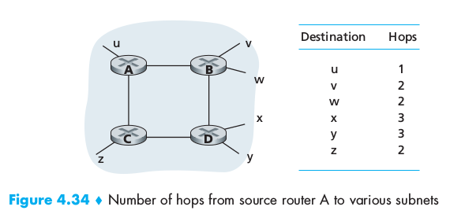

Routing updates [messages] are exchanged between neighbors approximately every 30 seconds using a **RIP response message**, which contains a list of up to 25 destination subnets within the AS as well as the sender's distance to each of those subnets. Response messages are also known as **RIP advertisements**.
Each router maintains a RIP table known as a **routing table** which includes both the router's distance vector and the router's forwarding table. There are three columns in it: the destination subnet, the identity of next router along shortest path to reach destination and the number of hops to get to the destination along the shortest path.

If a router doesn't hear from its neighbor for at least once every 180 seconds, that neighbor is considered to be no longer reachable (died or link down).
Routers can also request information about its neighbor's cost to a given destination using RIP's request messages, which are transmitted over UDP using port 520.
RIP is implemented in software but has access to the routing tables through the UNIX kernel.

### 4.6.2 Intra-AS Routing in the Internet: OSPF
OSPF and the related IS-IS are typically deployed in upper-tier ISPs whereas RIP is deployed in lower-tier ISPs and enterprise networks. Open indicates that the routing protocol speficication is publicly available.
It was conceived as the successor to RIP. It is however a **link state protocol** that uses **flooding of link-state information** and a **Dijkstra least-cost path algorithm**: routers construct a complete topological map (graph) of the AS, then run Dijkstra's algorithm to determine a shortest-path tree to *all subnets* with itself as the root node. Link costs are individually configured by the networks administrator who might choose to set all the link costs to 1, thus achieving minimum hop routuing or might choose to set the link weights to be *inversely proportional to link capacity* in order to discourage traffic from using low-bandwidth links.
A router broadcasts routing information to ***all other routers*** in the AS, not just the neighbors. The broadcast happens whenever there is a change in a link's state or every 30 minutes if the link's state doesn't change. OSPF advertisements are contained in **OSPF messages**  that are carried by IP with an upper-lyerprotocol of 89 for OSPF, therefore OSPF must implement reliable message transfer and link-state broadcast; OSP also checks that links are operational using HELLO messages to attached neighbors. OSPF offers some services:

 - *security*: OSPF messages can be authenticated (not active by default).
 - *multiple same-cost paths*: two paths having same cost can be used at the same time.
 - *integrated support for unicast and multicast routing*
 - *support for hierarchy within a single routing domain*: ability to structure an autonomous system hierarchically. A OSPF AS can be configured hierarchically into areas, each running its own OSPF algorithm, with each router broadcasting its link state to all other routers in that area. **Area border routers** are responsible for routing packets outside the area and one area is configured to be the **backbone area**, which routes traffic between other areas in the AS, it contains area border routers but also normal routers.

### 4.6.3 Inter-AS Routing: BGP
The **Border Gateway Protocol (BGP)** is the de facto standard inter-AS routing protocol in today's Internet. It provides each AS means to:

 - obtain reachability information from neighboring ASs
 - propagate reachability information to all internal routers
 - determine good routes to subnets using reachability information and AS policy.
 - it allows **each subnet to advertise its existence to the rest of the Internet**

#### Basics
It is a very complex algorithm. Routers exchange information over semipermanent TCP connections using port 179. There is typically one such BGP TCP connection for each link directly connecting two routers in two different ASs but there are also semipermanent TCP connections between routers in the same AS. For each connection, the two routers at the end of it are called **BGP peers** and the connection is called a **BGP session**. A session spanning two ASs is an **external BGP (eBGP) session** and BGP sessions between routers within an AS is called an **internal BGP (iBGP) session**. Destinations are not hosts, but CIDRized **prefixes**, each representing a subnet or collection of subnets.

#### Path Attributes and BGP Routes
In BGP an AS is identified by its **globally unique AS number (ASN)** which is assigned by ICANN regional registries. When a router advertises a prefix across a BGP session, it includes with the prefix a number of **BGP attributes**, a prefix with its attributes is called a **route**. Two other important attributes are:

 - *AS-PATH*: contains the ASs through which the advertisement for the prefix has passed. When a prefix is passed into an AS, the AS adds its ASN to the AS-PATH.
 This attribute is used to detect and prevent looping advertisements (if router sees that its AS is already in AS-PATH, it rejects the ad) and to choose among multiple paths to the same prefix.
 -*NEXT-HOP*: **the router interface that begins the AS-PATH**.

BGP also includes attributes allowing routers to assign preferences metrics to the routes and indicating how to prefix was inserted into BGP at the origins.
When a router receives a route advertisement, it uses its **import policy** to decide whether to accept or filter the route and whether to set certain attributes such as the router preference metrics.

#### BGP Route Selection
The input of the selection is the set of all routes that have been learned and accepted by the router. If two or more routes exist for the same prefix, elimination rules are applied until only one remains.

# Chapter 8: Security in Computer Networks

## 8.1 What is Network Security?
Desirable properties of **secure communication**:

 - *Confindentiality*: only sender and receiver should be able to understand the contents of the transmitted message -> encryption
 - *Message integrity*: make sure the content of the communication is not altered -> checksum
 - *End-point authentication*: sender and receiver should be able to confirm the identity of the other party involved in the communication.
 - *Operation security*: ability to counter attacks to internal networks -> firewalls, IPS, IDS

Possible attacks:

 - *eavesdropping*: sniffing and recording messages flowing in a channel
 - *modification, inserion, deletion* of messages or message content

These two allow to mount many other types of attacks

## 8.2 Principle of Cryptography
See Information Science, BA2
ADDITION:

#### Block Ciphers
Today there are two broad classes of symmetric encryption techniques: **stream ciphers** and **block ciphers**(used for PGP, SSL, IPssec)
In a block cipher, the message to be encrypted is processed into blocks of *k* bis and each block is encrypted independently. To encode a bloc, the cipher uses a *on-to-one* mapping to map the *k*-bit block of cleartext to a *k*-bit block of ciphertext. To avoid bruteforce attacks, cipher blocks usually employ large blocks (*k*=64) but longer blocks implies longer tables to store the mappings.
Block ciphers typically use functions that simulate randomly permuted tables. EX
64 bit input split into 8 8-bit chunks, each of which is processed by a 8-bit to 8-bit table, each chunk having its table. The encrypted chunks are reassembled into a 64 bits message which is fed again to the input. After *n* such cycles, the function provides a 64-bit block of ciphertext. The key for this block would be the eight permutation tables, assuming that the scramble function is publicly known. Popular block ciphers: DES (Data Encryption Standard), 3DES, AES (Advanced Encryption Standard). These use functions instead of predetermined tables. Each of them uses a string of bits for a key (64-bit blocks with 56-bit key in DES, 128-bits blocks and 128/192/256 bits-long keys)

##### Cipher-Block Chaining
We need to avoid long messages avoiding that two or more identical ciphertexts (produced for identical cleartexts by a symmetric encryption).
(I DON'T FINISH THIS PART, IT GOES TOO DEEP INTO ENCRYPTION TECHNIQUES WHICH IS NOT WHAT WE ARE INTERESTED IN)

## 8.3 Message Integrity and Digital Signatures
We want to provide **message integrity** (aka message authentication). Message integrity is verified when:

 - The message received indeed originated from the sender
 - The message was not tampered with on its way to the receiver

### 8.3.1 Cryptographic Hash Functions
A **hash function** takes an input *m* and computes a fixed length size string *H(m)* known as a hash. A **cryptographic hash function** is required to have an additional property:

**it is computationally infeasible to find any two different messages *x* and *y* such that H(x) = H(y)**
Some used cryptographic hashing functions are md5, SHA...

### 8.3.2 Message Authentication Code
To perform message integrity we also need a shared secret *s*, called the **authentication key**. The procedure is then:

 1. Alice creates message *m*, concatenates *m+s* and computes the hash *H(m+s)* to create the **message authentication code (MAC)**
 2. Alice **appends the MAC to the message** *m* creating *(m+H(m+s))*
 3. Bob receives the message and knowing the hash function and the secret, computes the hash. He creates *H(m+s)* and compares it with what he received.

MAC is nice because *it doesn't require any encryption algorithm*
The most popular standard of mac today is **HMAC** which can be used with either MD5 or SHA-1. The problem then is: how to distribute the secret?
 Physically?

### 8.3.3 Digital Signatures
A **digital signature** is a cryptographic technique to indicate the owner or creator of a document or to signify one's agreement with a document's content.
Just as with handwritten signatures, digital signatures should be created in a way that they are **verifiable** (prove that the the author of a signature is indeed the author) and nonforgeable** (prove that only that individual could have signed the document).
We can use the public and private keys we already created for asymmetric confidentiality.
To sign a message *m* Bob can encrypt the message with the **private key** (only the matching public key will be able to decrypt).
However encryption and decryption and computationally expensive therefore:

 1. Bob computes the hash of the message
 2. Bob uses his private key to encrypt the hash
 3. Bob contants the encrypted hash and the message
 4. Alice can decrypt, find the hash, compute a hash herself check for identity

We saw that both digital signatures and MACs involve using a hash function but digital signatures, requiring encryption, need heavier operations and also need a *Public Key infrastructure* (PKI) with certification authorities.

#### Public Key Certification
An important application of digital signatures is **public key certification**, that is, **certifying that a public key belongs to a specific entity**. It is used in IPsec and SSL.
A **Certification Authority** binds a public key to a particular entity. It has the follow roles:

 1. A CA verifies that an entity (person, router, ...) is who it says it is. The method depends on the authority
 2. The CA creates a **cerificate** that binds the public key of the entity to the identity. The certificate contains the public key and globally unique identifying information about the owner of the public key. The **certificate is digitally signed by the CA**

## 8.4 End-Point Authentication
**End-point authentication** is the process of one entity proving its identity to another entity over a computer network.
Authentication must be done solely on the basis of messages and data exchanged as part of an **authentication protocol**. Typically this would run before the two communicating parties run some other protocol.

We can analyze authentication developing a simple algorithm step by step:

#### Version 1.0
Alice simply sends a message to Bob saying "I'm Alice"
#### Version 2.0
Alice and Bob always communicate using the same addresses. Bob can simply check that the message has the source IP of Alice. However is fairly easy to spoof an IP address: crafting a special datagram is feasible using a custom kernel e.g Linux.
#### Version 3.0
Alice and Bob could share a secret password, a secrete between the authenticator and the person being authenticated.
Alice: I'm Alice, Password.
However password can be eavesdropped, sniffed (read and stored).
#### Version 3.1
We could encrypt the password using a shared symmetric cryptographic key.
However this protocol is subject to **playback attacks** an eavesdropper could sniff the encrypted secret and, without having to decrypt, could send it to impersonate Alice.
#### Version 4.0
To avoid playback attacks we could use the same principle behind TCP's three way handshake. A **nonce** is a number that a protocol will use only once in a lifetime.
The procedure is then:

 1. Alice sends: `I am Alice`
 2. bob chooses a nonce and sends it to Alice
 3. Alice encrypts it using Alice and Bob's symmetric secret key and sends the encrypted nonce.
 4. Bob decrypts the received nonce and checks for equality with the one he generated.

## 8.5 Securing e-mail
Security functionalities are provided by many layers of the network stack. Why? There is a need for security at higher layers as well as blanket coverage at lower layers and it easier to provide security at higher layers.

### 8.5.1 Secure E-Mail
What features do we want? *Confindentiality, Sender authentication, Receiver authentication*.
 - Confidentiality: to overcome the problem of sharing a symmetric secret, Alice and Bob use asymmetric cryptography. Bob makes his public key publicly available (key server or web page) and Alice encrypts her message with Bob's public key. Bob can decrypt using his private key. However asymmetric crypto is quite inefficient. A *session key* can be used: Alice selects a **random symmetric key**. She uses it to encrypt the message. She the encrypts this key using Bob's public key and concatenates the symmetricly encrypted message and the asymmetricly encrypted key.
 - Sender authentication and message integrity: we suppose that Alice and Bob don't care for confidentiality. They will use **digital signatures** and **message digests**.
 Alice applies a hash function *H* to her message *m*, obtain a message digest, signs the digest with her private key to create a digital signature, concatenates the original message with the signature to create a package and sends the package to Bob's e-mail address.
 Bob uses Alice's public key to the digest and compares the result fo this operation with his own hash *H* of the message.
 - Confidentiality, sender authentication and message integrity: the two procedures above can be combined, message and digest are concatenated and the treated as a new message which is encrypted using the first technique.

These techniques suppose however that Alice and Bob are able to exchange their public keys. An intruder could in fact send a public key to Bob pretending to be Alice. *Certification is needed*.

#### Phil Zimmermann and PGP
PZ was the creator of PGP. For that he was legally attacked by the US Government, he distributed PGP while it should have stayed a secret weapon in the heads of the defense. The US dropped the case and PGP became the most widely used e-mail encryption software in the world despite the lack of funding, paid staff.

### 8.5.2 PGP
Pretty Good Privacy (PGP) is an e-mail encryption scheme that has become the De Facto standard.
It uses the same design shown above, giving the option of signing, encrypting or both.
When PGP is installed, it creates a public key pair for the user, the public key can be posted online while the private key is protected by a password which has to be entered every time the user accesses the private key.
A PGP message appears after the **MIME** header.
PGP also provides a mechanism for public key certification. PGP public keys are certified by ***Web of Trust***: Alice can certify any key/username pair when she believes the pair really belong together and, in addition, PGP permits Alice to say that she trusts another user to vouch for the authenticity of more keys. Some PGP users sign each other's key by holding *key-signing parties*.

## 8.6 Securing TCP Connections: SSL
We now move to the transport layer. The enhanced version of TCP is called **Secure Socket Layer (SSL)**, a slightly modified version of SSL v3 called **Transport Layer Security (TLS)** has been standardized by the IETF.
Originally developed by Netscape, SSL has enjoyed broad deployment since its origins, providing secure communication between all recent browsers and online services. **SSL provides TCP with confidentiality, data integrity, server authentication and client authentication**.
SSL is often used over HTTP, however, as it secures TCP, it can be employed by any application that runs over TCP. SSL provides a simple *Application Programming Interface* with sockets, similar to TCP's API.
When an application wants to use SSL, it must include SSL classes/libraries. **Technically SSL resides in the application layer** but from the developer's perspective it is a transport layer protocol that provides TCP's services enhanced with security services.

### 8.6.1 The Big Picture (primitive almost-SSL)
Three phases:

 1. **Handshake**: Bob initiates a TCP connection is established (TCP SYN, SYNACK, ACK). Bob sends *SSL Hello*, Alice responds with her certificate containing her public key (the certificate being certified by a CA, Bob is sure that the key belongs to Alice). Bob generates a ***master secrect (MS)***, encrypts it with Alice's public key to create the ***Encrypted Master Secret (EMS)*** and sends it to Alice who will decrypt it with her private key to get the MS which can be used for confidentiality and integrity as seen before.
 2. **Key Derivation** instead of using the MS for integrity and confidentiality, it is safer to use different keys for different functions. Therefore *both* Alice and Bob **use the MS to generate**:
 	- Eb = session encryption key for data Bob -> Alice
	- Mb = session MAC key for data Bob -> Alice
	- Ea = session encryption key for data Alice -> Bob
	- Ma = session MAC key for data Alice -> Bob
The MS could simply be split in four chunks, but real SSL does it differently.
 3. **Data Transfer** TCP is a byte-stream protocol, so where would we put the MAC for the integrity check? SSL breaks the data stream into **records**, appends a MAC to each record and then encrypts record+MAC. However, in a MITM attack, the order of packets could be reversed as TCP sequence numbers are not encrypted. SSL therefore uses sequence numbers. Bob keeps a sequence number counter which begins at zero and is incremented at each record transmission. He includesthe sequence number in the MAC calculation: MAC = hash(data+Mb+SeqNum). Alice tracks Bob's sequence numbers so that she can verify the MAC.

#### SSL Record
The real SSL record:

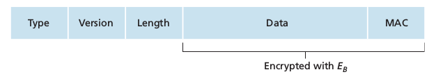

 - Type: handshake message, data message, connection teardown message
 - Length: used to extract the records out of the TCP byte stream

### 8.6.2 A More Complete Picture
SSL allows Alice and Bob to agree on the cryptographic algorithms at the beginning of the SSL session, during handshake. Steps:

 1. The client sends a list of cryptographic algorithms it supports, along with a client nonce
 2. The server chooses a symmetric algorithm (ex: AES), a public key algorithm (ex RSA) and a MAC algorithm. It sends back to the client its choices as well as a certificate and a server nonce.
 3. The client verifies the certificate, extracts the server's public key, generates a *Pre-Master Secret* (PMS), encrypts it with the server's public key and sends the encrypted PMS to server.
 4. Using the same key derivation function (specified by SSL standard), *client and server independently compute the Master Secret (MS) from the PMS and the nonces*. The MS is sliced up to create the two encryption and the two MAC keys. Furthemore when the symmetric cipher employs CBC (ex 3DES or AES) the two Initialization Vectors (IVs), one for each side of the connection, are also obtained from hte MS. Henceforth **all messages sent between client and server are encrypted and authenticated (using MAC)**
 5. The client sends a MAC of all the handshake messages
 6. The server sends a MAC of the handshake messages.

5 and 6 protect the handshake from tampering: if in the end MAC are not coherent with the previously sent messages, the connection is stopped. (prevents an attacker from impersonating the server and imposing weak algorithms).
Nonces are used to avoid *connection replay attacks* (resending packets sniffed during a previous connection again, using nonces allows to have different MACs and therefore messages at each connection, even if the content of the communication is the same).

#### Connection Closure
TCP FIN segments can be crafted by an attacker (*truncation attack*), therefore they cannot be used.
The type field of SSL records is used for these purpose, even if it sent in the clear, it is authenticated at the receivers using record's MAC.

## 8.7 Network-Layer Security: IPsec and Virtual Private Networks
The IP security protocol is called **IPsec**, it secures IP datagrams between any two network-layer entities (host, routers)

### 8.7.1 IPsec and Virtual Private Networks (VPNs)
An institution extending overt multiple geographical regions might want its own IP network so that the machines in it can communicate securely. Such a disjoint network is a **private network**. A physical private network can be expensive. VPN can be used to deploy and maintain a private network over the existing public Internet. The traffic is sent over the Internet but encrypted before entering the public net.
Not all traffic sent into the Internet by the gateway routers or laptops will be IPsec secured (only the portion accessing internal resources)

### 8.7.2 The AH and ESP Protocols
In the IPsec protocol suite, there are two principal protocols: the **Authentication Header (AH)** protocol and the **Encapsulation Security Payload (ESP)** protocol.
When a source IPsec entity (router or host) sends secure datagrams to a destination entity it does so with either ESP or AH. AH provides *source authentication* and *data integrity* while ESP provides *source authentication, data integrity and confidentiality*. Because the latter is often critical for VPNs, ESP is much more widely used AH. We will only study ESP.

### 8.7.3 Security Associations
Before sending IPsec datagrams from source entity to destination entity, source and destination create a network-layer logical connection called **security association (SA)**. SA is a simplex (unidirectional from source to destination) logical connection. If both entities want to send datagrams to each other, then two SAs need to be established, one in each direction.
The VPN server (headquarters gateway router) will maintain state information about the SA, which will include:

 - 32-bit identifier for the SA, called *Security Parameter Index (SPI)*
 - The origin interface (client outside) of the SA and its destination (its out facing interface) [IP addresses]
 - Type of the encryption used
 - Encryption key
 - Type of the integrity check
 - Authentication key

An IPsec entity often maintains state information for many SAs (all outside clients) using its *Security Association Database* (SAD) which is a data structure in the entity's OS kernel.

### 8.7.4 The IPsec Datagram
IPsec has two different packet forms, one for **tunnel mode** and one for **transport mode**, the first one, being more appropriate for VPNs, is more widely deployed than the transport mode, we will therefore only focus on it.

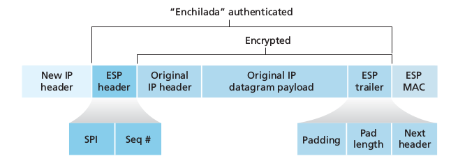

The headquarters's gateway receives an IPv4 datagram from inside the network directed to a VPN client outside. Here is what happens:

 1. It appends to the back of the original datagram (which includes the original header fields) in the *ESP trailer* field
 2. It encrypts the result using the algorithm and key specified in the SA
 3. Appends to the front of the result a *ESP Header* creating the "enchilada"
 4. Creates an authentication MAC over the whole enchilada using algorithm and key specified in the SA
 5. Appends the MAC to the back of the enchilada forming the *payload*
 6. Creates a brand new IP header with all the classic IPv4 header fields which it appends before the payload.

The protocol number field is set to 50, designating IPsec. The routers along the path will treat the datagram as a normal one, oblivious that it is an IPsec datagram.
To decide whether outgoing packets should be treated as above or simply let through, the gateway maintains a *Security Policy Database* (SPD) which indicates what types of datagrams (as a function of the source and destination IPs and of the protocol) are to be IPsec processed and, for those that are, which SA should be used.
**IPsec provides confidentiality, source authentication, data integrity, replay-attack prevention.**

### 8.7.5 IKE: Key Management in IPsec
Who/What should populate the SAD? For small VPNs this can be done manually. For larger ones there is the ***Internet Key Exchange (IKE) protocol***.
IKE is similar to the handshake in SSL. Here are the steps:

 - During the first exchange of messages, the two sides use Diffie-Hellman to create a Bi-Directional IKE SA between the routers, which is entirely different form the IPsec SA discussed above. This IKESA provides an authenticated and encrypted channel between the two routers. Keys are established for encryption and authentication for IKESA. Also established is a master secret.
 - During the second exchange of messages, both sides reveal their identity to each other by signing their messages. However the identities are not revealed to an eventual sniffer, since the messages are sent over the IKE sa channel. The two sides also negotiate the IPsec encryption and authentication algorithms to be employed by the IPsec SA. Finally the two sides create an SA n each direction.

We have two phases to reduce computational costs: we don't need asymmetric cryptography during second phase, allowing IKE to generate many SAs with relatively little computational cost.

## 8.9 Operational Security: Firewalls and Intrusion Detection Systems

### 8.9.1 Firewalls
A firewall is a combination of hardware and software that isolates an organization's internal network from the Internet at large, allowing some packets to pass and blocking others. It has three goals

 1. *All traffic from outside to inside, and vice versa, passes through the firewall*
 2. *Only authorized traffic, as defined by the local security by the local policy, will be allowed to pass*.
 3. *The firewall itself is immune to penetration*

Firewalls can be classified in three categories:

#### 1: Traditional Packet Filters
Packet filters examine each datagram in isolation determining whether the datagram should be allowed to pass or should be dropped based on administrator-specific rules.
Filtering decisions can be based on IP source/destination, protocol type, TCP/UDP, TCP flags/ ICMP message type, rules for leaving/entering, rules for different router interfaces.
The parameters are based on the policy of the organization taking account of user productivity and bandwidth usage as well as security concerns.

#### 2: Stateful Packet Filters
Decisions are made on each packet in isolation. Stateful filters track TCP connecions and use this knowledge to make filtering decisions.

#### 3: Application Gateways
Application Gateways look beyond the IP/TCP/UDP headers and make policy decisions based on application data. An **Application Gateway** is an application-specific server through which all application data must pass. Multiple AG can run on the same host, but each gateway is a separate server with its own processes.

### 8.9.2 Intrusion Detection Systems
An **intrusion detection system (IDS)** is a device that alerts when it observes potentially malicious traffic. An **intrusion prevention system (IPS)**  is a device that filters out suspicious traffic. Both types of device perform **deep packet inspection**: they look beyond the header fields and into the actual application data that the packets carry.

An IDS can detect a wide range of attacks, including network mapping, port scans, TCP stack scans, DoS, worms, viruses, OS vulnerability attacks and application vulnerability attacks.
An organization can deploy one more IDS sensors in its network. When many are used, they work together, usually coordinated by a central server. More than one is often a good solution as each one compare each passing packet with tens of thousands of signatures. They are usually classified as either **signature-based systems** or **anomaly-based systems**.
A signature based IDS maintains an extensive database of attack signature, each of which being a set of rules pertaining to an intrusion activity. A signature can be a list of packet characteristics or may relate to a series of packets. They are created by network security engineers researching attacks. The ids sniffs every packet passing by it, comparing it with signatures.
Signature based IDS, although widely deployed, have a number of limitations: they require a previous knowledge of the attack to generate an accurate signature, false alarms may be generated, they can be slow and fail to detect attacks if overwhelmed.
Anomaly-based packets study normal traffic and looks for statistically unusual events. They don't rely on previous knowledge of attacks.

# Chapter 5: The Link Layer: Links, Access Networks and LANs

## 5.1 Introduction to the Link Layer
Some terminology:

 - **node** = any device running a link-layer protocol (hosts, routers, switches...)
 - **link** = communication channels connecting adjacent nodes along the path.
 - Over a given link, a transmitting node encapsulates the datagram in a **link-layer frame** and transmits the frame into the link.

### 5.1.1 The Services Provided by The Link Layer
Possible services offered by a link-layer protocol include:

 - *Framing*: all link layer protocols encapsulate each network layer datagram  within a link-layer frame before transmission. A frame consists of a data field, containing the datagram, and a number of header fields, whose structure is determined by the protocol.
 - *Link access*: A **Medium Access Control** (MAC) protocol specifies the rules by which a frame is transmitted onto the link.
 - *Reliable delivery*: the protocol guarantees to move each datagram across the link without loss or errors. A reliable delivery protocol is often used for links highly prone to errors (WiFi) so that the error can be corrected locally, where it happens, rather than forcing an end-to-end retransmission. However it can represent a significant overhead for low bit-error links (cable) and therefore many wired link-layer protocols do not provide a reliable delivery service.
 - *Error detection and correction*: signal attenuation and electromagnetic noise can introduce errors. Because there is no need to forward a datagram that has an error, may link-layer protocols provide a mechanism to detect such bit errors so that they can drop the frames. This can be accomplished transmitting error-detection bits in the frame. Link layer error detection is usually more sophisticated and *implemented in hardware*.

### 5.1.2 Where Is the Link Layer Implemented?
In routers, the link layer is implemented in the line card. Is a host's link layer implemented in hardware or software?
For the most part, the link layer is implemented in a **network adapter**, sometimes known as **network interface card (NIC)**. At the heart of the NIC is the link-layer controller, usually a single, special purpose chip that implements many of the link-layer services. Thus, much of a link-layer controller's functionality is implemented in hardware.
Part of the link layer is implemented in software that runs on the host's CPU, this part implement higher-level functionalities.
Link-Layer is a combination of hardware and software, the place in the protocol stack where software meets hardware.

## 5.2 Error-Detection and -Correction Techniques
Error detection and correction allow the receiver to sometimes, *but not always*, detect that bit errors have occurred. Even with the use of error-detection bits, there still may be **undetected bit errors** (the receiver is unaware of the presence of corrupted bits).
We want to keep the probability of such an event small. Let's now consider three techniques for detecting errors in the transmitted data: parity checks, checksumming methods and cyclic redundancy checks

### 5.2.1 Parity Checks
Perhaps the simplest form of error detection is the use of a single **parity bit**. Suppose that the information to be sent, *D*, has *d* bits.
In an even parity scheme, the sender simply includes one additional bit and chooses its value such that the total number of 1s in the *d+1* bits (original + parity bit) is even. (odd parity scheme, parity bit to one if #1s % 2 != 0).
The receiver only needs to count the number of 1s in the *d+1* bits. If an odd number of 1 valued bits are found with an even parity scheme, the receiver knows that *some odd number* of bit error has occurred.
If an even number of bit errors occur, this would result in an undetected error.
Another approach is to use a ***two dimensional even parity***: the *d* bits are divided into *i* rows and *j* columns. A parity value is computed for each row and for each column. The result *i + j + 1* parity bits comprise the error-detection bits.
A single bit error in the original *d* bits will cause the parity of both the column and the row containing the flipped bit to to be in error. The receiver can not only detect the error, but also use the column and row indices of the column and row with parity errors to actually identify the bit that was corrupted and *correct* the error.
This technique also allows to detect an error in the *parity bits*.
The ability of the receiver to both detect and correct errors is known as **forward error correction (FEC)**

### 5.2.2 Checksumming Methods
The *d* bits of data are treated as a sequence of *k*-bit integers for example the Internet checksum already studied: bytes of data are treated as integers and summed, the 1s complement of this sum forms the Internet checksum carried in the header. The receiver checks the checksum by taking the 1s complement of the sum of the received data (including checksum) and checking whether the result is all 1 bits, if there are any 0, an error is indicated. In TCP and UDP the checksum is computed over all fields (header and data).
Checksumming methods require little packet overhead but they provide relatively weak protection against errors.
Why is checksumming used in transport layer and cyclic redundancy check used at the link layer?
Transport layer is implemented in software (OS) and therefore needs a simple and fast error detection scheme while error detection at link layer is implemented in hardware which can perform the more complex CRC operations.

### 5.2.3 Cyclic Redundancy Check (CRC)
**Cyclic Redundancy Check (CRC) codes** are also known as **polynomial codes** since it is possible to view the string to be sent as a polynomial whose coefficients are the 0 and 1 values in the bit string with operation interpreted as polynomial arithmetic.
Sender and receiver must agree on a *r+1* bit pattern know as **generator** which we'll denote as *G*. We require the leftmost bit of G to be a 1. For a given piece of data *D* the sender will choose *r* additional bits, *R*, and append them to *D* such that the resulting *d + r* bit pattern, interpreted as a binary number, is exactly divisible by G using modulo-2 arithmetic.
Checking is therefore easy: the receiver divides the *d + r* received by bits by *G*, if the remainder is nonzero, an error has occurred, otherwise the data is accepted as being correct.
All CRC calculations are done in modulo 2 without carries in addition or borrows in subtraction (+ = - = xor).

## 5.3 Multiple Access Links and Protocols
There are two types of network links: point-to-point and broadcast links. A **point-to-point link** consists of a single sender at one end of the link and a single receiver at the other end of the link. A **broadcast link** can have multiple sending and receiving nodes all connected to the same, single, shared broadcast channel. The term *broadcast* is used because when any node transmits a frame, the channel broadcasts the frame and each other node receives a copy (ex: ethernet, wireless).

The **multiple access problem**: How to coordinate the access of multiple sending and receiving nodes to a shared broadcast channel?
Computer networks have **multiple access protocols** by which nodes regulate their transmission into the shared broadcast channel.
More than two nodes can transmit frames at the same time, which will result in all of the nodes receiving multiple frames at the same time: the frames **collide** at all of the receivers. Typically in case of collision, *none of the receiving nodes can make any sense of any of the frames*, they become inextricably tangled together and are therefore **lost**, the channel being wasted during collision.
Thus it is necessary to coordinate the transmission of the active nodes.
We can classify multiple access protocols in three categories: **channel partitioning protocols, random access protocols, taking-turns protocols**.

### 5.3.1 Channel Partitioning Protocols
TDM and FDM (from circuit switching) are in this category.
A third channel partitioning tool is **code division multiple access (CDMA)** which assigns a different *code* to each node. Each node then uses its unique code to encode the data bits it sends. If the codes are chosen carefully, then all nodes can transmit simultaneously and yet have their respective receivers correctly receive a sender's encoded data bits. Originally used in military systems, it's now widely used for civilian use, particularly in cellular telephony.

### 5.3.2 Random Access Protocols
A transmitting node always transmits at the full rate of the channel, *R* bps. When there is a collision, each node involved in the collision repeatedly retransmits its frame until the frame gets through without a collision.
But when a node experiences a collision, *it waits a random dely before retransmitting the frame*. The delay is chosen independently.
Here a few of the most commonly used random access protocols:

#### Slotted ALOHA
All frames consist of *L* bits, time is divided into slots of size *L/R* seconds, nodes start to transmit frames only at the beginning of slots. Moreover nodes are synchronized so that each node when the slot begins. If two or more frames collide in a slot, then all the nodes detect the collision event before the slot ends.

If *p* is a probability then the operation of slotted ALOHA in each node is simple:

 - each node waits the beginning of the next slot to transmit the entire frame in a slot
 - If no collision occurs, the frame is considered delivered
 - If collision, this is detect before the end of the slot. The node retransmits its frame *in each subsequent slot* with probability *p* (probability of retransmission) until the frame is transmitted  without a collision.

Slotted ALOHA allows transmission at full rate *R*, is highly decentralized, and is extremely simple.
The computed maximal efficiency (successfully used slots in transmission / total slots) of Slotted ALOHA) is 37% thus the effective transmission rate is 0.37*R* bps.

#### Aloha
all nodes synchronize their transmissions to start at the beginning of a slot. The node immediately transmits a frame in its entirety in the channel. In case of collision, the node will then immediately retransmit the frame with probability *p* otherwise the node waits for a frame transmission time, after which it transmits the frame with probability *p* or wait for another frame with probability *1-p*. The maximum efficiency is 1/(2e) but the protocol is fully decentralized.

#### Carrier Sense Multiple Access (CSMA)
CSMA and CSMA/CD (collision detection) embody two rules:

 - **carrier sensing**: if a node is transmitting, the others wait until they detect no transmission for a short amount of time and begin transmission.
 - **collision detection**: a transmitting node listens to the channel while it's transmitting, if it detects that another node is transmitting, it stops transmitting and waits for a random amount of time before repeating the sense-and-transmit-when-idle-cycle.

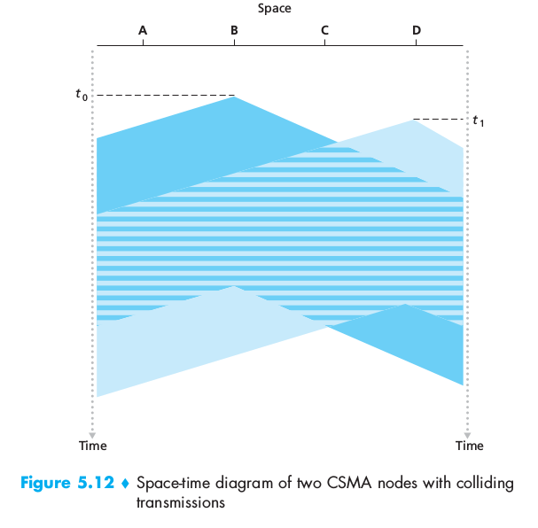

It is evident that the **propagation delay** of the channel plays a crucial role: the longer, the larger the chance that a carrier sensing node is not yet able to sense a transmission that has already begun.

#### Carrier Sense Multiple Access with Collision Detection (CSMA/CD)
When a node detects a collision, it ceases transmission immediately in Collision Detection.
A link layer frame is prepared, if the node senses that the channel is idle (no energy is entering the adapter from the channel), it starts to transmit the frame, else it waits until it detects idle. While transmitting, the node monitors the channel for usage from other nodes, if the entire frame is transmitted without detecting usage, then the adapter is finished. If energy is detected from other adapters while transmitting, the node aborts transmission (stops), waits for  a random amount of time and then returns to checking for idle.

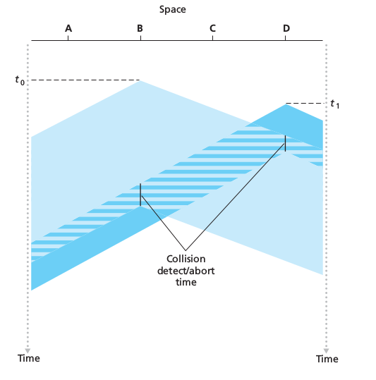

The wait for random amount of time is required in order to avoid the nodes to keep colliding.

#### CSMA/CD Efficiency
Is the long run fraction of time during which frames are being transmitted without collision. If the propagation delay approaches 0, the efficiency approaches 1.
Also if the propagation delay becomes very large, efficiency approaches 1.

### 5.3.3 Taking-Turns Protocols
There are a lot of them, we'll cover two of the more important, the first one being the **polling protocol**. It requires one of the nodes to be designated as a master node which **polls** each of the nodes in a round-robin fashion.
The master tells node 1 that it can transmit up to some maximum number of frames, when node 1 is finished (the master checks for energy in the channel) the master tells the same to node 2 and so on.
The polling protocol eliminates the collisions and empty slots that plague random access protocols, resulting in a much higher efficiency.
However it introduces a *polling delay* (the amount of time required to notify a node that it can transmit) [if only one is transmitting, it will have to wait for the master to poll all the others]. Moreover the master node represents a single point of failure.

The second protocol is the **token-passing protocol** in which there is no master method. A small, special purpose frame known as **token** is exchanged among the nodes in some fixed order. When a node receives a toke, it holds it only if it has some frames to transmit otherwise it immediately forwards it to the next node.If a node has frames to transmit when it receives the token, it sends up to a maximum number of frames and then passes the token. Token passing is decentralized and highly efficient but the failure of one node could crash the entire channel, or a node could neglect to release the token....

### 5.3.4 DOCSIS: The Link-Layer Protocol for Cable Internet Access
The Data-Over-Cable-Service-Interface-Specifications specifies the cable data network architecture and its protocols. DOCSIS uses FDM to divide the downstream and upstream network segments into multiple frequency channels. Each upstream and downstream channel is a broadcast channel. Several cable modems share the same upstream channel (frequency) to the CMTS and thus collision can potentially occur.
Each upstream channel is divided into intervals of time (TDM-like) each containing a sequence of mini-slots during which cable modems can transmit to the CMTS, which explicitly grants permission to individual modems to transmit during specific mini-slots. This is done sending a special control message known as a MAP message on a downstream channel to specify which cable modem can transmit during which mini-slot.
Modems send mini-slot-request frames to the CMTS during a special set of interval mini-slots dedicated for this purpose. The requests are transmitted in a random access manner and may collide with each other. The modem cannot detect activity nor collisions: it simply infers that its request experienced collision if it does not receive a response in the next downstream control message.
When a collision is inferred, a modem uses binary exponential backoff to defer the transmission to a future slot.

## 5.4 Switched Local Area Networks
Switched local networks connect hosts using link-layer switches which **do not run networks-layer protocols**.

### 5.4.1 Link-Layer Addressing and ARP

#### MAC Addresses
Network interfaces in hosts and routers have link-layer addresses, however *link-layer switches do not have link-layer addresses associated with their interfaces* so that they can carry datagrams without having routers or hosts having to explicitly address the frame to the intervening switch.
A link-layer address is called **LAN address**, **physical address** or **MAC address**, the last name being the most popular. This address is **6 bytes long**, typically expressed in hexadecimal notation. They are supposed to be permanent but can be changed via software.
**No two adapters have the same address**: the IEEE manages the MAC address space, usually assigning a 24 prefix to each manufacturer and letting him choose the content of the remaining 24 bits.
MAC address have a flat structure (no hierarchy such as in IP) and do not change.
When an adapter wants to send a frame to some destination adapter, it inserts the destination adapter's MAC address into the frame and then sends the frame into the LAN. An adapter might receive a frame that isn't addressed to it, when this happens, the adapter checks whether the frame's destination address matches its own, if not it discards the frame. When a sending adapter want to broadcast to the whole network, it inserts a special **MAC broadcast address** into the destination address field, for 6bytes addresses that is FF-FF-FF-FF-FF-FF

#### Address Resolution Protocol (ARP)
The **Address Resolution Protocol (ARP)** translates network-layer addresses into link-layer addresses, analogously to DNS, but ARP resolves IP addresses only for hosts and router interfaces on the same subnet.
Each host and router has an **ARP table** which contain mappings of IP addresses to MAC addresses and a time-to-live TTL value which indicates when each mapping will be deleted from the table. A typical TTL is 20 minutes from when an entry is placed in the ARP table.
The table does not necessarily contain an entry for every host and router on the subnet.
What if a frame has to be sent to an address which does not appear in the table?
The sender creates a special packet, an **ARP packet**, containing the sending and receiving IP and MAC addresses. Both ARP query and response have the same format: the sending forwards the ARP request to the broadcast address (destination address) the frame containing the query is received by all the other adapters in the subnet. Each adapter passes the frame to the ARP module which checks if its IP address matches the destination IP address in the query. The one with a match sends back the response with the desired mapping. The querying can update its table and send the IP datagram encapsulated in a link-layer frame.
ARP is plug and play: the table gets build automatically.
ARP stands in the boundary between the link and network layers.

### Sending a Datagram off the Subnet
A datagram that has to be sent out of the subnet is first sent to the first-hop router on the path to the final destination (which is outside the subnet). How is its MAC acquired? Using ARP.
When the frame reaches the next-hop router of the destination subnet, it has to be moved inside, the router having to decide what interface to use. This is done using the forwarding table: the router extracts the datagram and checks the destination IP. The datagram is encapsulated again and sent into the subnet, this time the MAC address of the frame is indeed the destination MAC address of the ultimate destination, which the router acquire via ARP.

### 5.4.2 Ethernet
It has pretty much taken over the wired LAN market. Since its invention in the 70's, it has grown and become faster.
At the beginning the original Ethernet LAN used a coaxial bus to interconnect the nodes, creating a broadcast LAN. By the late 90s, most companies and universities had replaces their LANs with Ethernet installation using a hub-based star topology: hosts and routers are directly connected to a hub with twisted-pair copper wire. A **hub** is a physical layer device that acts on individual bits rather than frames. When a hub receives a bit, it simply recreates it boosting its energy strength and transmits the bit onto all the other interfaces (it's still a broadcast LAN). In the early 2000s, the star topology evolved: the hub was replaced with a **switch**, allowing a collision-less LAN.

#### Ethernet Frame Structure

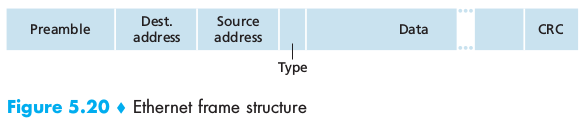

 - *Data fields* (46 to 1,500 bytes): carries the IP datagram (or other network-layer datagram). The MTU (maximum transmission unit) is 1500 bytes, compensated with fragmentation. The minimum is 46, is less, the data is "stuffed" and the receiving network layer uses the length field to eliminate the stuffing
 - *Destination address* (6 bytes) destination MAC address.
 - *Source address* (6 bytes)
 - *Type field* (2 bytes) allows to multiplex network layer protocols (if not only IP is used, also ARP has its own type number 0x0806)
 - *Cyclic redundant check (CRC)* (4 bytes): used for bit error detection
 - *Preamble* (8 bytes): the first seven have value 10101010, the last has value 10101011. The first seven serve as "wake up" the receiving side and to *synchronize their clocks to that of the sender's clock* the two 1s at the end of byte 8 alerts the receiver that the important stuff is about to come.

All of the Ethernet technologies provide **connectionless service**  (no handshaking, similar to UDP) and **unrealiable service** to the network layer (no ACK, drop in case of errors) which help to make Ethernet simple and cheap.
If there are gaps due to discarded Ethernet frames, the fact that the application sees the gaps or not depends on the transport layer protocol used: not with TCP (reliable data transfer), yes with UDP.

#### Ethernet Technologies
There are many variants and flavors of Ethernet which have been standardized over the years by the IEEE. They vary in speed: 10 Megabit, 100 Megabit, 1000 Megabit, 10 Gigabit...
They can also vary in the type of traffic they can transport....

### 5.4.3 Link-Layer Switches
Switch receive and forward frames. They are **transparent**: adapters address each other, without knowing that the switch is sitting in the middle. As they're output rate might be smaller than the input rate, they also have buffers to queue frames.

### Forwarding and Filtering
**Filtering** is the switch function that determines whether a frame should be forwarded to some interface or should just be dropped.
**Forwarding** is the switch function that the determines the interfaces to which a frame should be directed and then moves the frame to those interfaces.
Switch filtering and forwarding are done with a **switch table** which contains entries for some (not necessarily all) of the hosts and routers on a LAN. Each entry contains:
`(MAC address, interface leading toward that MAC, time at which the entry was placed in the table)`
Switches forward frames based on the MAC addresses rather than on IP addresses.

When a switch receives a frame:

 - There is no entry in the table associated with the destination address -> the packet is broadcast through all the interfaces (except the one through which the frame was received)
 - There is an entry in the table that point to the same interface through which the frame was received -> The frame is discarded (filtering)
 - There is an entry in the table that point to an interface different from the one through which the frame was received -> the frame is put in the output buffer preceding the interface discovered thanks to the table (forwarding)

#### Self-Learning
The switch table is build ***automatically, dynamically and autonomously*** without any intervention from a network administrator: **switches are self learning**.

 1. The switch table is initially empty
 2. For each incoming frame, the switch stores in its table
 	1. the MAC address in the frame's *source address field*
	2. the interface from which the frame arrived
	3. the current time
 3. The switch deletes an address in the table if no frame are received with that address as the source after some period (**aging time**) so that to eliminate unused entries from the table

Thus switches are **plug-and-play devices**: they require no human intervention. Switches are also full-duplex, meaning any interface can send and receive at the same time.

#### Properties of Link-Layer Switching
Advantages over buses or hubs:

 - *Elimination of collisions*: the switch buffers frames and never transmit more than one frame on a segment at any one time. The maximum aggregated throughput is the sum of all the switch interface rates
 - *Heterogeneous links*: The switch providing isolation, different links can operate at different speeds and run over different media. Therefore switches are ideal for mixing legacy equipment with new equipment.
 - *Management*: A switch can disconnect a malfunctioning adapter and a cut cable isolates only one host. Switches can gather statistics useful for debugging and planning the evolution of the network.

#### Switches Versus Routers
They are both packet switches but switches are layer-2 packet switches while routers are layer-3 packet switches.
Switches are plug-and-play, have relatively high filtering and forwarding rates.
However to **prevent the cycling of broadcast frames, the active topology of a swtiched network is restricted to a spanning tree**. A large network requires large ARP tables in hosts and routers and would generate substantial ARP traffic and processing. Switches are also susceptible to broadcast storms: if one goes crazy and send an endless stream of broadcast frames, the others will forward all of the frames resulting in a network collapse.
Routers network addressing is hierarchical, packets do not normally cycle and the topology is not limited to a spanning tree even when the network has redundant paths. Therefore packets can use the best path between source and destination. But routers are not plug-and-play (a host need the IP to connect) and often have a larger per-packet processing time than switches. Finally two pronunciation cause a lot of disputes.

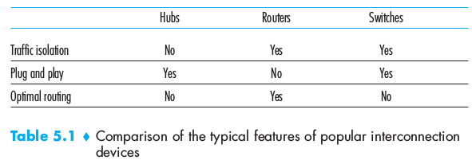

### 5.4.4 Virtual Local Area Networks (VLANs)
